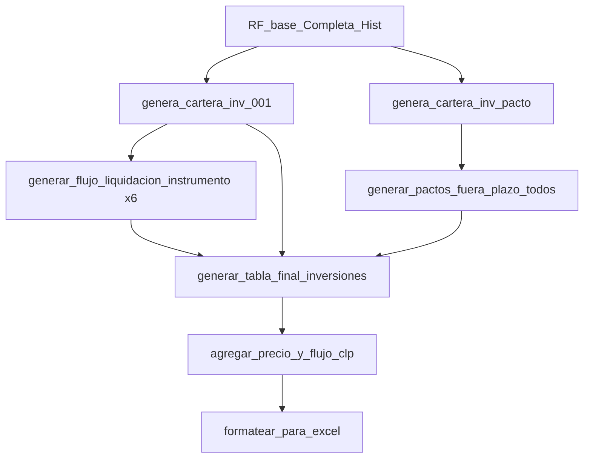

# Plan de Corrección: Pactos Fuera de Plazo y Flujo No Circular

> **Fecha**: 2026-02-04  
> **Prioridad**: 🔴 Alta - Corrige error de diseño  
> **Branch**: `feat/modelo-inversiones`

---

## 1. Diagnóstico del Problema

### 1.1 Problema de Circularidad

**Situación actual (incorrecta):**
```
tablas_access (pickle de Access)
    ↓
df_pactos = tablas_access['RF_PLI_044c_Add_Pactos_FB']  ← ¡OUTPUT de Access!
    ↓
generar_tabla_final_inversiones(df_pactos=df_pactos)
    ↓
Comparar vs tablas_access['RF_PLI_046_Tabla_Final']  ← ¡Comparando output vs output!
```

**Situación correcta:**
```
INPUTS (tablas externas):
├── RF_base_Completa_Hist_Input  ← Cartera base
├── RF_Fecha_Proceso_Carteras    ← Fecha proceso
├── RF_Base_Diaria_Precios       ← Precios TCRC
├── FPL                          ← Factores haircut
├── RF_FactXXX                   ← Factores por instrumento
└── RF_MontosLiq                 ← Límites de liquidación

PROCESO PYTHON (lo que traducimos):
├── genera_cartera_inv_001()     → RF_PLI_001_CarteraInv
├── genera_cartera_inv_pacto()   → RF_PLI_001d_CarteraInv_Pcto
├── generar_flujo_liquidacion_instrumento() → Flujo_GobCLP, etc.
├── [NUEVO] generar_pactos_fuera_plazo() → RF_PLI_044b, RF_PLI_044c
└── generar_tabla_final_inversiones() → RF_PLI_044e

VALIDACIÓN (opcional, solo para comparar):
└── tablas_access['Flujo_GobCLP'] vs flujo_gob_clp  ← Comparar outputs
```

### 1.2 Queries Faltantes

| Query | Función Python | Estado |
|-------|----------------|--------|
| RF_PLI_001d_CarteraInv_Pcto | `genera_cartera_inv_pacto()` | ✅ Existe |
| RF_PLI_002_CarteraGobCLP_Pacto | `generar_cartera_instrumento()` | ✅ Existe (reutilizable) |
| RF_PLI_003b_GobCLP_MontoPlazo_Pacto | `generar_monto_plazo_pacto()` | ✅ Existe |
| RF_PLI_003c_Monto_FueraPlazo | **FALTA** | ⚠️ Crear |
| RF_PLI_044b_Pacto_FB | **FALTA** | ⚠️ Crear (UNION) |
| RF_PLI_044c_Pacto_FB | **FALTA** | ⚠️ Crear (formatear) |

**Nota:** Las queries RF_PLI_003b existe pero se usa solo para el modelo de liquidación (haircut).
Para los pactos >90 días necesitamos reutilizarla y luego filtrar.

---

## 2. Análisis de Código Existente

### 2.1 helpers.py - Funciones Reutilizables

```python
# Ya existe - genera RF_PLI_001d
genera_cartera_inv_pacto(df_base, df_fecha, verbose=True)

# Ya existe - genera RF_PLI_003b (agrupa por Dias_Pacto)
generar_monto_plazo_pacto(df_cartera_pacto, verbose=True)
```

### 2.2 output/tabla_final.py - Lo Que Hay Que Corregir

```python
# ACTUAL (incorrecto):
def generar_cartera_pactos(
    df_pactos: pd.DataFrame,  # ← Espera tabla pre-generada
    fecha_proceso,
    verbose=True
) -> pd.DataFrame:
    # Asume que df_pactos ya tiene: Moneda, Dias_Pacto, Monto
    # PERO esta tabla no existe como input, es un output de Access

# CORRECTO:
def generar_pactos_fuera_plazo(
    df_cartera_inv_pacto: pd.DataFrame,  # ← RF_PLI_001d
    fecha_proceso,
    umbral_dias: int = 90,
    verbose=True
) -> pd.DataFrame:
    # 1. Filtrar por instrumento
    # 2. Sumar VP por Dias_Pacto
    # 3. Filtrar Dias_Pacto > umbral
    # 4. Formatear al esquema final
```

### 2.3 Flujo de queries RF_PLI_001d → RF_PLI_044c

```
RF_PLI_001d_CarteraInv_Pcto (genera_cartera_inv_pacto)
    │
    ├── Filtrar por instrumento (generar_cartera_instrumento reutilizable)
    │   ├── GobCLP: BCP, BTP, PDB
    │   ├── GobCLF: BCU, BTU, CER
    │   ├── DPF: DPF, FFM
    │   ├── DPR: DPR
    │   ├── LCH: LCH, BBC (CLF)
    │   └── BBC: BBC (CLP)
    │
    ├── Sumar por Dias_Pacto (generar_monto_plazo_pacto reutilizable)
    │
    ├── Filtrar Dias_Pacto > 90 (NUEVO: simple filter)
    │
    └── Formatear al esquema final (NUEVO o adaptar generar_cartera_pactos)
```

---

## 3. Plan de Implementación

### Fase 1: Refactorizar generar_pactos (1-2 horas)

#### Task 1.1: Crear `generar_monto_fuera_plazo_instrumento()`

**Archivo:** `output/tabla_final.py` o `pipeline/pactos.py` (nuevo)

```python
def generar_monto_fuera_plazo_instrumento(
    df_cartera_inv_pacto: pd.DataFrame,
    tipo_instrumento: str,
    umbral_dias: int = 90,
    verbose: bool = True
) -> pd.DataFrame:
    """
    Genera montos de pactos fuera de plazo para un instrumento.
    
    Implementa cadena: RF_PLI_XXX_Cartera*_Pacto → RF_PLI_XXXb → RF_PLI_XXXc
    
    Args:
        df_cartera_inv_pacto: Cartera de pactos (RF_PLI_001d)
        tipo_instrumento: 'GobCLP', 'GobCLF', 'DPF', 'DPR', 'LCH', 'BBC'
        umbral_dias: Umbral para considerar "fuera de plazo" (default 90)
        
    Returns:
        DataFrame con columnas: Dias_Pacto, Monto, Moneda
    """
```

**Lógica:**
1. Filtrar cartera por códigos de instrumento
2. Agrupar por Dias_Pacto, sumar VP_Cap_Amort + VP_Int_Total
3. Filtrar donde Dias_Pacto > umbral_dias
4. Agregar columna Moneda según instrumento

#### Task 1.2: Crear `generar_pactos_fuera_plazo_todos()`

```python
def generar_pactos_fuera_plazo_todos(
    df_cartera_inv_pacto: pd.DataFrame,
    fecha_proceso: Union[int, str, datetime],
    umbral_dias: int = 90,
    verbose: bool = True
) -> pd.DataFrame:
    """
    Genera tabla de pactos fuera de plazo para todos los instrumentos.
    
    Implementa: RF_PLI_044b (UNION) + RF_PLI_044c (formatear)
    
    Returns:
        DataFrame con esquema: Fec_Pro, Cod_Emp, Moneda, Cod_A_P, Cod_Pro,
                               Cod_Sub_Pro, Fec_Pago, Dias_Pago, Cap_Amort,
                               Int_Total_Cont, VP_Cap_Amort, VP_Int_Total_Cont
    """
```

**Lógica:**
1. Para cada instrumento, llamar a `generar_monto_fuera_plazo_instrumento()`
2. Concatenar resultados (UNION ALL)
3. Formatear al esquema de tabla final

#### Task 1.3: Modificar `generar_tabla_final_inversiones()`

**Cambio de firma:**
```python
# ANTES:
def generar_tabla_final_inversiones(
    flujos: Dict[str, pd.DataFrame],
    fecha_proceso,
    df_base: Optional[pd.DataFrame] = None,
    df_pactos: Optional[pd.DataFrame] = None,  # ← QUITAR
    verbose: bool = True
) -> pd.DataFrame:

# DESPUÉS:
def generar_tabla_final_inversiones(
    flujos: Dict[str, pd.DataFrame],
    fecha_proceso,
    df_base: Optional[pd.DataFrame] = None,
    df_cartera_inv_pacto: Optional[pd.DataFrame] = None,  # ← CAMBIAR
    verbose: bool = True
) -> pd.DataFrame:
```

**Cambio interno:**
- En lugar de llamar a `generar_cartera_pactos(df_pactos)`, 
- Llamar a `generar_pactos_fuera_plazo_todos(df_cartera_inv_pacto)`

---

### Fase 2: Actualizar Tests (30 min)

#### Task 2.1: Tests para `generar_monto_fuera_plazo_instrumento()`

```python
class TestGenerarMontoFueraPlazoInstrumento:
    def test_filtra_por_umbral(self):
        """Solo retorna pactos con Dias_Pacto > 90"""
        
    def test_suma_por_dias_pacto(self):
        """Agrupa correctamente VP_Cap_Amort + VP_Int_Total"""
        
    def test_asigna_moneda_correcta(self):
        """GobCLP→CLP, GobCLF→CLF, etc."""
```

#### Task 2.2: Tests para `generar_pactos_fuera_plazo_todos()`

```python
class TestGenerarPactosFueraPlazoTodos:
    def test_union_todos_instrumentos(self):
        """Concatena los 6 instrumentos"""
        
    def test_formatea_esquema_final(self):
        """Columnas correctas para tabla final"""
```

---

### Fase 3: Corregir Notebook (30 min)

#### Task 3.1: Eliminar referencias circulares

**Celda 48:** Cambiar de:
```python
df_base = tablas_access.get('RF_PLI_001b_TblCartera_RFBFA', pd.DataFrame())
df_pactos = tablas_access.get('RF_PLI_044c_Add_Pactos_FB', pd.DataFrame())
```

A:
```python
# df_base viene de genera_cartera_inv_001() - ya calculado
# df_cartera_inv_pacto viene de genera_cartera_inv_pacto() - ya calculado
df_cartera_inv_pacto = queries.get('RF_PLI_001d_CarteraInv_Pcto', pd.DataFrame())
```

#### Task 3.2: Actualizar llamadas a generar_tabla_final_inversiones()

```python
df_tabla_final = generar_tabla_final_inversiones(
    flujos=flujos,
    fecha_proceso=fecha_proceso,
    df_base=queries['RF_PLI_001_CarteraInv'],  # Para garantías
    df_cartera_inv_pacto=queries['RF_PLI_001d_CarteraInv_Pcto'],  # Para pactos >90
    verbose=True
)
```

#### Task 3.3: Celdas de comparación vs Access (solo validación)

Las celdas de comparación deben ser SOLO para validar que el output Python 
coincide con el output Access, no para obtener inputs.

---

### Fase 4: Documentar y Commit (15 min)

#### Task 4.1: Actualizar docstrings

Agregar en cada función nueva:
- SQL de referencia (query Access que implementa)
- Ejemplo de uso
- Descripción de la lógica de negocio

#### Task 4.2: Actualizar PLAN_IMPLEMENTACION.md

Marcar Task 4.2.4 como "corregida" y agregar nota sobre pactos fuera de plazo.

---

## 4. Configuración de Instrumentos para Pactos

Reutilizar `CONFIGURACION_INSTRUMENTOS` de helpers.py:

| Instrumento | Códigos | Moneda |
|-------------|---------|--------|
| GobCLP | BCP, BTP, PDB | CLP |
| GobCLF | BCU, BTU, CER | CLF |
| DPF | DPF, FFM | CLP |
| DPR | DPR | CLF |
| LCH | LCH, BBC (Moneda=CLF) | CLF |
| BBC | BBC (Moneda=CLP) | CLP |

**Nota:** LCH y BBC comparten código BBC pero difieren en moneda.

---

## 5. Estimación de Esfuerzo

| Tarea | Tiempo | Complejidad |
|-------|--------|-------------|
| Task 1.1: generar_monto_fuera_plazo_instrumento | 45 min | ⭐⭐ |
| Task 1.2: generar_pactos_fuera_plazo_todos | 30 min | ⭐⭐ |
| Task 1.3: Modificar generar_tabla_final_inversiones | 20 min | ⭐ |
| Task 2.1-2.2: Tests | 30 min | ⭐⭐ |
| Task 3.1-3.3: Corregir notebook | 30 min | ⭐ |
| Task 4.1-4.2: Documentar | 15 min | ⭐ |
| **TOTAL** | **~3 horas** | |

---

## 6. Criterios de Validación

### 6.1 Tests Unitarios
- [ ] `generar_monto_fuera_plazo_instrumento()` retorna solo Dias_Pacto > 90
- [ ] `generar_pactos_fuera_plazo_todos()` incluye los 6 instrumentos
- [ ] Esquema de salida coincide con COLUMNAS_TABLA_FINAL
- [ ] Monedas asignadas correctamente

### 6.2 Validación vs Access
- [ ] Suma de Cap_Amort de pactos coincide con Access (< 1 peso diferencia)
- [ ] Número de filas de pactos coincide
- [ ] Tabla final completa coincide con RF_PLI_044e de Access

### 6.3 No Circularidad
- [ ] Notebook NO lee tablas RF_PLI_* de tablas_access (excepto para validación)
- [ ] Todos los inputs son tablas externas (RF_base_*, FPL, etc.)

---

## 7. Dependencias y Orden de Ejecución



---

## 8. Checklist Pre-Implementación

- [x] Análisis de queries faltantes documentado
- [x] Impacto en código existente evaluado
- [x] Plan de implementación creado
- [ ] Revisión del plan con usuario
- [ ] Inicio de implementación

---

## 9. Notas Adicionales

### ¿Por qué 90 días?

El modelo de liquidación tiene un horizonte de 90 días. Los pactos con plazo mayor
no se incluyen en el cálculo de haircut diario porque están "fuera del horizonte".
Pero sí se deben incluir en la tabla final como flujos que llegarán eventualmente.

### ¿Qué pasa si no hay pactos >90 días?

Es válido. La función debe retornar un DataFrame vacío con las columnas correctas.
La UNION con los flujos del modelo funciona igual.

### ¿Dónde ubicar las nuevas funciones?

**Opción A:** En `output/tabla_final.py` (mantener todo junto)
**Opción B:** En nuevo archivo `pipeline/pactos.py` (separar responsabilidades)

Recomendación: Opción A por ahora, refactorizar después si crece mucho.
