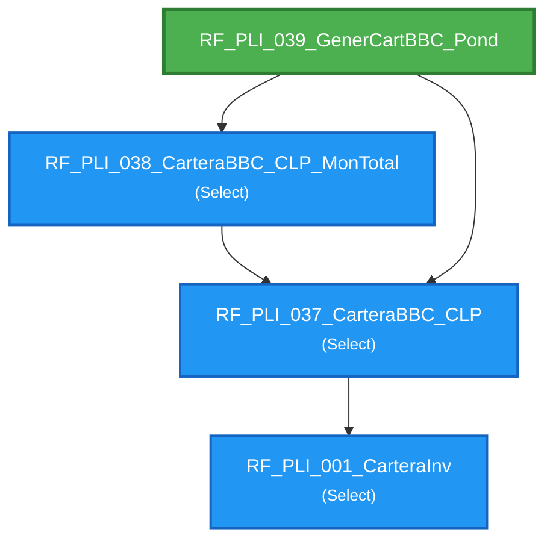

# Flujo de Queries - RF_PLI_039_GenerCartBBC_Pond

**Entry Point:** `RF_PLI_039_GenerCartBBC_Pond`

**Queries alcanzables:** 4

---

## Flowchart

---

## Listado de Queries

🔹 **RF_PLI_001_CarteraInv** (Select)

🔹 **RF_PLI_037_CarteraBBC_CLP** (Select)
   - Depende de: RF_PLI_001_CarteraInv

🔹 **RF_PLI_038_CarteraBBC_CLP_MonTotal** (Select)
   - Depende de: RF_PLI_037_CarteraBBC_CLP

🎯 **RF_PLI_039_GenerCartBBC_Pond** (DDL)
   - Depende de: RF_PLI_037_CarteraBBC_CLP, RF_PLI_038_CarteraBBC_CLP_MonTotal

