# Flujo de Queries - RF_PLI_044e_Modelo_Inversiones_Tabla_Final

**Entry Point:** `RF_PLI_044e_Modelo_Inversiones_Tabla_Final`

**Queries alcanzables:** 32

---

## Flowchart

```mermaid
flowchart TD
  %% Estilos
  classDef entryClass fill:#4CAF50,stroke:#2E7D32,stroke-width:3px,color:#fff
  classDef queryClass fill:#2196F3,stroke:#1565C0,stroke-width:2px,color:#fff
  classDef ddlClass fill:#FF9800,stroke:#E65100,stroke-width:2px,color:#fff
  classDef tableClass fill:#9E9E9E,stroke:#424242,stroke-width:1px,color:#fff

  %% Nodos
  RF_PLI_001b_CarteraInv_Gtia["RF_PLI_001b_CarteraInv_Gtia<br/><small>(Select)</small>"]:::queryClass
  RF_PLI_001c_CarteraInv_Gtia["RF_PLI_001c_CarteraInv_Gtia<br/><small>(Select)</small>"]:::queryClass
  RF_PLI_001d_CarteraInv_Pcto["RF_PLI_001d_CarteraInv_Pcto<br/><small>(Select)</small>"]:::queryClass
  RF_PLI_002_CarteraGobCLP_Pacto["RF_PLI_002_CarteraGobCLP_Pacto<br/><small>(Select)</small>"]:::queryClass
  RF_PLI_003b_GobCLP_MontoPlazo_Pacto["RF_PLI_003b_GobCLP_MontoPlazo_Pacto<br/><small>(Select)</small>"]:::queryClass
  RF_PLI_003c_Monto_FueraPlazo["RF_PLI_003c_Monto_FueraPlazo<br/><small>(Select)</small>"]:::queryClass
  RF_PLI_008b_CarteraGobCLP_Final["RF_PLI_008b_CarteraGobCLP_Final<br/><small>(Select)</small>"]:::queryClass
  RF_PLI_009_CarteraGobCLF_Pacto["RF_PLI_009_CarteraGobCLF_Pacto<br/><small>(Select)</small>"]:::queryClass
  RF_PLI_010b_GobCLF_MontoPlazo_Pacto["RF_PLI_010b_GobCLF_MontoPlazo_Pacto<br/><small>(Select)</small>"]:::queryClass
  RF_PLI_010c_Monto_FueraPlazo["RF_PLI_010c_Monto_FueraPlazo<br/><small>(Select)</small>"]:::queryClass
  RF_PLI_015b_CarteraGobCLF_Final["RF_PLI_015b_CarteraGobCLF_Final<br/><small>(Select)</small>"]:::queryClass
  RF_PLI_016_CarteraDPF_Pacto["RF_PLI_016_CarteraDPF_Pacto<br/><small>(Select)</small>"]:::queryClass
  RF_PLI_017b_DPF_MontoPlazo_Pacto["RF_PLI_017b_DPF_MontoPlazo_Pacto<br/><small>(Select)</small>"]:::queryClass
  RF_PLI_017c_Monto_FueraPlazo["RF_PLI_017c_Monto_FueraPlazo<br/><small>(Select)</small>"]:::queryClass
  RF_PLI_022b_CarteraDPF_Final["RF_PLI_022b_CarteraDPF_Final<br/><small>(Select)</small>"]:::queryClass
  RF_PLI_023_CarteraDPR_Pacto["RF_PLI_023_CarteraDPR_Pacto<br/><small>(Select)</small>"]:::queryClass
  RF_PLI_024b_DPR_MontoPlazo_Pacto["RF_PLI_024b_DPR_MontoPlazo_Pacto<br/><small>(Select)</small>"]:::queryClass
  RF_PLI_024c_Monto_FueraPlazo["RF_PLI_024c_Monto_FueraPlazo<br/><small>(Select)</small>"]:::queryClass
  RF_PLI_029b_CarteraDPR_Final["RF_PLI_029b_CarteraDPR_Final<br/><small>(Select)</small>"]:::queryClass
  RF_PLI_030_CarteraLCH_Pacto["RF_PLI_030_CarteraLCH_Pacto<br/><small>(Select)</small>"]:::queryClass
  RF_PLI_031b_LCH_MontoPlazo_Pacto["RF_PLI_031b_LCH_MontoPlazo_Pacto<br/><small>(Select)</small>"]:::queryClass
  RF_PLI_031c_Monto_FueraPlazo["RF_PLI_031c_Monto_FueraPlazo<br/><small>(Select)</small>"]:::queryClass
  RF_PLI_036b_CarteraLCH_Final["RF_PLI_036b_CarteraLCH_Final<br/><small>(Select)</small>"]:::queryClass
  RF_PLI_037_CarteraBBC_CLP_Pacto["RF_PLI_037_CarteraBBC_CLP_Pacto<br/><small>(Select)</small>"]:::queryClass
  RF_PLI_038b_BBC_CLP_MontoPlazo_Pacto["RF_PLI_038b_BBC_CLP_MontoPlazo_Pacto<br/><small>(Select)</small>"]:::queryClass
  RF_PLI_038c_Monto_FueraPlazo["RF_PLI_038c_Monto_FueraPlazo<br/><small>(Select)</small>"]:::queryClass
  RF_PLI_043b_CarteraBBC_Final["RF_PLI_043b_CarteraBBC_Final<br/><small>(Select)</small>"]:::queryClass
  RF_PLI_044_Modelo_Inversiones_Final["RF_PLI_044_Modelo_Inversiones_Final<br/><small>(Type128)</small>"]:::queryClass
  RF_PLI_044b_Modelo_Inversiones_Pacto_FB["RF_PLI_044b_Modelo_Inversiones_Pacto_FB<br/><small>(Type128)</small>"]:::queryClass
  RF_PLI_044c_Modelo_Inversiones_Pacto_FB["RF_PLI_044c_Modelo_Inversiones_Pacto_FB<br/><small>(Select)</small>"]:::queryClass
  RF_PLI_044d_Modelo_Inversiones_Full["RF_PLI_044d_Modelo_Inversiones_Full<br/><small>(Type128)</small>"]:::queryClass
  RF_PLI_044e_Modelo_Inversiones_Tabla_Final["RF_PLI_044e_Modelo_Inversiones_Tabla_..."]:::entryClass

  %% Dependencias
  RF_PLI_001c_CarteraInv_Gtia --> RF_PLI_001b_CarteraInv_Gtia
  RF_PLI_002_CarteraGobCLP_Pacto --> RF_PLI_001d_CarteraInv_Pcto
  RF_PLI_003b_GobCLP_MontoPlazo_Pacto --> RF_PLI_002_CarteraGobCLP_Pacto
  RF_PLI_003c_Monto_FueraPlazo --> RF_PLI_003b_GobCLP_MontoPlazo_Pacto
  RF_PLI_009_CarteraGobCLF_Pacto --> RF_PLI_001d_CarteraInv_Pcto
  RF_PLI_010b_GobCLF_MontoPlazo_Pacto --> RF_PLI_009_CarteraGobCLF_Pacto
  RF_PLI_010c_Monto_FueraPlazo --> RF_PLI_010b_GobCLF_MontoPlazo_Pacto
  RF_PLI_016_CarteraDPF_Pacto --> RF_PLI_001d_CarteraInv_Pcto
  RF_PLI_017b_DPF_MontoPlazo_Pacto --> RF_PLI_016_CarteraDPF_Pacto
  RF_PLI_017c_Monto_FueraPlazo --> RF_PLI_017b_DPF_MontoPlazo_Pacto
  RF_PLI_023_CarteraDPR_Pacto --> RF_PLI_001d_CarteraInv_Pcto
  RF_PLI_024b_DPR_MontoPlazo_Pacto --> RF_PLI_023_CarteraDPR_Pacto
  RF_PLI_024c_Monto_FueraPlazo --> RF_PLI_024b_DPR_MontoPlazo_Pacto
  RF_PLI_030_CarteraLCH_Pacto --> RF_PLI_001d_CarteraInv_Pcto
  RF_PLI_031b_LCH_MontoPlazo_Pacto --> RF_PLI_030_CarteraLCH_Pacto
  RF_PLI_031c_Monto_FueraPlazo --> RF_PLI_031b_LCH_MontoPlazo_Pacto
  RF_PLI_037_CarteraBBC_CLP_Pacto --> RF_PLI_001d_CarteraInv_Pcto
  RF_PLI_038b_BBC_CLP_MontoPlazo_Pacto --> RF_PLI_037_CarteraBBC_CLP_Pacto
  RF_PLI_038c_Monto_FueraPlazo --> RF_PLI_038b_BBC_CLP_MontoPlazo_Pacto
  RF_PLI_044_Modelo_Inversiones_Final --> RF_PLI_001c_CarteraInv_Gtia
  RF_PLI_044_Modelo_Inversiones_Final --> RF_PLI_008b_CarteraGobCLP_Final
  RF_PLI_044_Modelo_Inversiones_Final --> RF_PLI_015b_CarteraGobCLF_Final
  RF_PLI_044_Modelo_Inversiones_Final --> RF_PLI_022b_CarteraDPF_Final
  RF_PLI_044_Modelo_Inversiones_Final --> RF_PLI_029b_CarteraDPR_Final
  RF_PLI_044_Modelo_Inversiones_Final --> RF_PLI_036b_CarteraLCH_Final
  RF_PLI_044_Modelo_Inversiones_Final --> RF_PLI_043b_CarteraBBC_Final
  RF_PLI_044b_Modelo_Inversiones_Pacto_FB --> RF_PLI_003c_Monto_FueraPlazo
  RF_PLI_044b_Modelo_Inversiones_Pacto_FB --> RF_PLI_010c_Monto_FueraPlazo
  RF_PLI_044b_Modelo_Inversiones_Pacto_FB --> RF_PLI_017c_Monto_FueraPlazo
  RF_PLI_044b_Modelo_Inversiones_Pacto_FB --> RF_PLI_024c_Monto_FueraPlazo
  RF_PLI_044b_Modelo_Inversiones_Pacto_FB --> RF_PLI_031c_Monto_FueraPlazo
  RF_PLI_044b_Modelo_Inversiones_Pacto_FB --> RF_PLI_038c_Monto_FueraPlazo
  RF_PLI_044c_Modelo_Inversiones_Pacto_FB --> RF_PLI_044b_Modelo_Inversiones_Pacto_FB
  RF_PLI_044d_Modelo_Inversiones_Full --> RF_PLI_044_Modelo_Inversiones_Final
  RF_PLI_044d_Modelo_Inversiones_Full --> RF_PLI_044c_Modelo_Inversiones_Pacto_FB
  RF_PLI_044e_Modelo_Inversiones_Tabla_Final --> RF_PLI_044d_Modelo_Inversiones_Full
```

---

## Listado de Queries

🔹 **RF_PLI_001b_CarteraInv_Gtia** (Select)

🔹 **RF_PLI_001c_CarteraInv_Gtia** (Select)
   - Depende de: RF_PLI_001b_CarteraInv_Gtia

🔹 **RF_PLI_001d_CarteraInv_Pcto** (Select)

🔹 **RF_PLI_002_CarteraGobCLP_Pacto** (Select)
   - Depende de: RF_PLI_001d_CarteraInv_Pcto

🔹 **RF_PLI_003b_GobCLP_MontoPlazo_Pacto** (Select)
   - Depende de: RF_PLI_002_CarteraGobCLP_Pacto

🔹 **RF_PLI_003c_Monto_FueraPlazo** (Select)
   - Depende de: RF_PLI_003b_GobCLP_MontoPlazo_Pacto

🔹 **RF_PLI_008b_CarteraGobCLP_Final** (Select)

🔹 **RF_PLI_009_CarteraGobCLF_Pacto** (Select)
   - Depende de: RF_PLI_001d_CarteraInv_Pcto

🔹 **RF_PLI_010b_GobCLF_MontoPlazo_Pacto** (Select)
   - Depende de: RF_PLI_009_CarteraGobCLF_Pacto

🔹 **RF_PLI_010c_Monto_FueraPlazo** (Select)
   - Depende de: RF_PLI_010b_GobCLF_MontoPlazo_Pacto

🔹 **RF_PLI_015b_CarteraGobCLF_Final** (Select)

🔹 **RF_PLI_016_CarteraDPF_Pacto** (Select)
   - Depende de: RF_PLI_001d_CarteraInv_Pcto

🔹 **RF_PLI_017b_DPF_MontoPlazo_Pacto** (Select)
   - Depende de: RF_PLI_016_CarteraDPF_Pacto

🔹 **RF_PLI_017c_Monto_FueraPlazo** (Select)
   - Depende de: RF_PLI_017b_DPF_MontoPlazo_Pacto

🔹 **RF_PLI_022b_CarteraDPF_Final** (Select)

🔹 **RF_PLI_023_CarteraDPR_Pacto** (Select)
   - Depende de: RF_PLI_001d_CarteraInv_Pcto

🔹 **RF_PLI_024b_DPR_MontoPlazo_Pacto** (Select)
   - Depende de: RF_PLI_023_CarteraDPR_Pacto

🔹 **RF_PLI_024c_Monto_FueraPlazo** (Select)
   - Depende de: RF_PLI_024b_DPR_MontoPlazo_Pacto

🔹 **RF_PLI_029b_CarteraDPR_Final** (Select)

🔹 **RF_PLI_030_CarteraLCH_Pacto** (Select)
   - Depende de: RF_PLI_001d_CarteraInv_Pcto

🔹 **RF_PLI_031b_LCH_MontoPlazo_Pacto** (Select)
   - Depende de: RF_PLI_030_CarteraLCH_Pacto

🔹 **RF_PLI_031c_Monto_FueraPlazo** (Select)
   - Depende de: RF_PLI_031b_LCH_MontoPlazo_Pacto

🔹 **RF_PLI_036b_CarteraLCH_Final** (Select)

🔹 **RF_PLI_037_CarteraBBC_CLP_Pacto** (Select)
   - Depende de: RF_PLI_001d_CarteraInv_Pcto

🔹 **RF_PLI_038b_BBC_CLP_MontoPlazo_Pacto** (Select)
   - Depende de: RF_PLI_037_CarteraBBC_CLP_Pacto

🔹 **RF_PLI_038c_Monto_FueraPlazo** (Select)
   - Depende de: RF_PLI_038b_BBC_CLP_MontoPlazo_Pacto

🔹 **RF_PLI_043b_CarteraBBC_Final** (Select)

🔹 **RF_PLI_044_Modelo_Inversiones_Final** (Type128)
   - Depende de: RF_PLI_001c_CarteraInv_Gtia, RF_PLI_008b_CarteraGobCLP_Final, RF_PLI_015b_CarteraGobCLF_Final, RF_PLI_022b_CarteraDPF_Final, RF_PLI_029b_CarteraDPR_Final, RF_PLI_036b_CarteraLCH_Final, RF_PLI_043b_CarteraBBC_Final

🔹 **RF_PLI_044b_Modelo_Inversiones_Pacto_FB** (Type128)
   - Depende de: RF_PLI_003c_Monto_FueraPlazo, RF_PLI_010c_Monto_FueraPlazo, RF_PLI_017c_Monto_FueraPlazo, RF_PLI_024c_Monto_FueraPlazo, RF_PLI_031c_Monto_FueraPlazo, RF_PLI_038c_Monto_FueraPlazo

🔹 **RF_PLI_044c_Modelo_Inversiones_Pacto_FB** (Select)
   - Depende de: RF_PLI_044b_Modelo_Inversiones_Pacto_FB

🔹 **RF_PLI_044d_Modelo_Inversiones_Full** (Type128)
   - Depende de: RF_PLI_044_Modelo_Inversiones_Final, RF_PLI_044c_Modelo_Inversiones_Pacto_FB

🎯 **RF_PLI_044e_Modelo_Inversiones_Tabla_Final** (DDL)
   - Depende de: RF_PLI_044d_Modelo_Inversiones_Full

