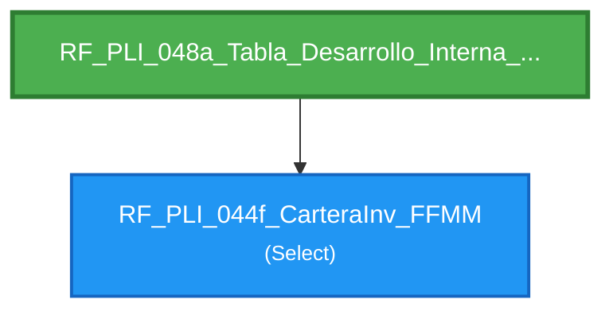

# Flujo de Queries - RF_PLI_048a_Tabla_Desarrollo_Interna_Add_FFMM

**Entry Point:** `RF_PLI_048a_Tabla_Desarrollo_Interna_Add_FFMM`

**Queries alcanzables:** 2

---

## Flowchart

---

## Listado de Queries

🔹 **RF_PLI_044f_CarteraInv_FFMM** (Select)

🎯 **RF_PLI_048a_Tabla_Desarrollo_Interna_Add_FFMM** (Type64)
   - Depende de: RF_PLI_044f_CarteraInv_FFMM

