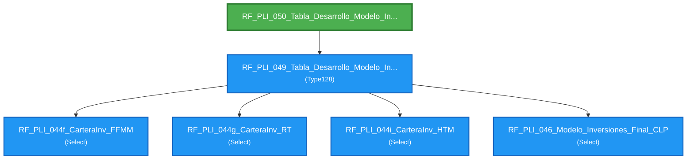

# Flujo de Queries - RF_PLI_050_Tabla_Desarrollo_Modelo_Inversiones_Excel

**Entry Point:** `RF_PLI_050_Tabla_Desarrollo_Modelo_Inversiones_Excel`

**Queries alcanzables:** 6

---

## Flowchart

---

## Listado de Queries

🔹 **RF_PLI_044f_CarteraInv_FFMM** (Select)

🔹 **RF_PLI_044g_CarteraInv_RT** (Select)

🔹 **RF_PLI_044i_CarteraInv_HTM** (Select)

🔹 **RF_PLI_046_Modelo_Inversiones_Final_CLP** (Select)

🔹 **RF_PLI_049_Tabla_Desarrollo_Modelo_Inversiones** (Type128)
   - Depende de: RF_PLI_044f_CarteraInv_FFMM, RF_PLI_044g_CarteraInv_RT, RF_PLI_044i_CarteraInv_HTM, RF_PLI_046_Modelo_Inversiones_Final_CLP

🎯 **RF_PLI_050_Tabla_Desarrollo_Modelo_Inversiones_Excel** (DDL)
   - Depende de: RF_PLI_049_Tabla_Desarrollo_Modelo_Inversiones

