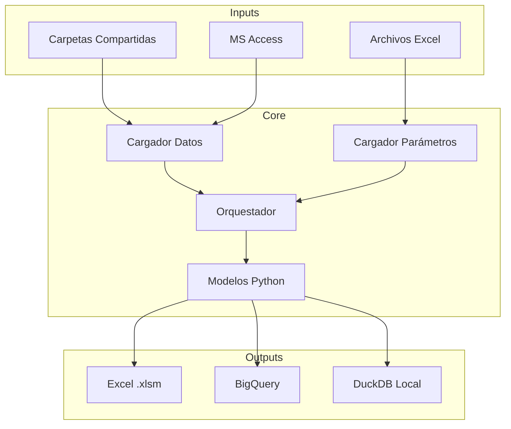

# Arquitectura del Sistema

> **Autor:** vlandaetat  
> **Fecha de creación:** 2026-01-29  
> **Última edición por:** vlandaetat  
> **Fecha última edición:** 2026-01-29

---

## Visión General



## Componentes Principales

### 1. Orquestador (`core/orquestador.py`)

Coordina la ejecución de modelos:

- Carga configuración
- Inicializa cargadores
- Ejecuta modelos en secuencia
- Maneja errores

### 2. Cargadores (`procesamiento_datos_input/`)

| Módulo | Responsabilidad |
|--------|-----------------|
| `cargador_datos.py` | Lee datos de carteras |
| `cargador_parametros.py` | Lee parámetros de Excel |
| `cargador_modelos.py` | Importa módulos de modelos |
| `limpiador_datos.py` | Normaliza y valida datos |

### 3. Modelos (`RF_Modelo_*/`)

Cada modelo es un módulo independiente con:

```
RF_Modelo_X/
├── __init__.py
├── ml_x.py           # Lógica principal
├── ml_x_cc.xlsm      # Template Excel
└── parametros/
    └── parametros_ml_x.xlsx
```

### 4. Carga GCP (`carga_modelos_gcp/`)

Módulos para interactuar con BigQuery:

- `cargar_output_modelos_bigquery_dly.py` - Modelos actuales
- `cargar_modelos_old.py` - Modelos legacy

## Patrones de Diseño

### Inyección de Dependencias

Los modelos reciben sus dependencias (datos, parámetros) desde el orquestador, facilitando testing y reutilización.

### Configuración Externalizada

Todas las rutas y parámetros están en archivos YAML/Excel, no hardcodeados en el código.

### Fail-Safe

Si un modelo falla, el sistema:

1. Loggea el error
2. Continúa con el siguiente modelo
3. Reporta resumen al final
