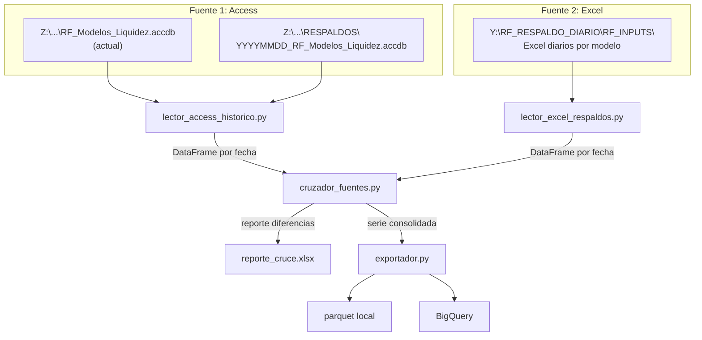

# F18 — Plan: Carga Históricos Pre-Python

!!! warning "DRAFT — Requiere revisión"
    Este plan es un borrador. Revisar con el equipo antes de comenzar la
    implementación. Marcar como aprobado en el roadmap una vez revisado.

> **Feature ID:** F18  
> **Autor:** vlandaetat  
> **Fecha:** 2026-02-26  
> **Estado:** Draft — pendiente revisión  
> **Última edición:** 2026-02-26

---

## Resumen Ejecutivo

Reconstruir la serie histórica completa de outputs de modelos de liquidez
generados **antes de la migración a Python**. Esto es crítico para:

1. **Continuidad regulatoria**: Serie ininterrumpida para reportes NCG 325
2. **Backtesting**: Validar el modelo Python contra resultados históricos
3. **Análisis de tendencias**: Dashboards que cubran todo el período operativo

### Las dos fuentes

| # | Fuente | Ruta | Formato | Cobertura esperada |
|---|--------|------|---------|--------------------|
| 1 | Access principal + respaldos | `Z:\RF_PROCESOS\RF_Modelos\` | `.accdb` | Serie completa pero posibles errores |
| 2 | Respaldos Excel diarios | `Y:\RF_RESPALDO_DIARIO\RF_INPUTS\` | `.xlsx` / `.xlsm` | Serie diaria, espejo del output real |

**Hipótesis**: ~95% de coincidencia entre ambas fuentes. Las diferencias
pueden ser por:

- Días donde Access se corrompió o no fue actualizado
- Re-ejecuciones manuales que sobrescribieron el Access pero no el respaldo
- Errores de copia manual al respaldo de Excel

**Decisión clave**: Implementar ambas lecturas y generar un reporte de cruce
que se revise **manualmente** antes de definir cuál es la "verdad" para cada fecha.

---

## Arquitectura Propuesta

```
carga_historicos/
├── __init__.py
├── lector_access_historico.py     # Fuente 1: Access + respaldos
├── lector_excel_respaldos.py      # Fuente 2: Excel diarios
├── cruzador_fuentes.py            # Comparación y reporte de diferencias
├── exportador.py                  # Salida a parquet/CSV/BigQuery
└── config.py                      # Rutas y parámetros de la carga
```



---

## Fases de Implementación

### Fase 1: Reconocimiento y Exploración (1 día)

**Objetivo**: Entender la estructura real de los datos antes de escribir código.

- [ ] **1.1 Explorar Access principal**
    - Conectar a `Z:\RF_PROCESOS\RF_Modelos\RF_Modelos_Liquidez.accdb`
    - Listar todas las tablas y queries
    - Identificar cuáles contienen datos de desarrollo de modelos
    - Documentar schema (columnas, tipos, rangos de fechas)

- [ ] **1.2 Explorar respaldos Access**
    - Listar archivos en `Z:\RF_PROCESOS\RF_Modelos\RESPALDOS\`
    - Verificar patrón de nombre: `YYYYMMDD_RF_Modelos_Liquidez.accdb`
    - Contar cuántos respaldos hay y rango de fechas
    - Abrir 3-4 respaldos: verificar que la estructura es idéntica al principal
    - Documentar irregularidades (archivos corruptos, nombres fuera de patrón)

- [ ] **1.3 Explorar respaldos Excel**
    - Listar contenido de `Y:\RF_RESPALDO_DIARIO\RF_INPUTS\`
    - Identificar patrón de nombres de archivos (¿por modelo? ¿por fecha?)
    - Verificar qué hojas contienen las tablas de desarrollo
    - Comparar schema con lo que devuelve Access
    - Documentar rango de fechas y huecos

- [ ] **1.4 Documentar hallazgos**
    - Crear `docs/feats/carga-historicos/exploracion.md` con lo encontrado
    - Listar diferencias de schema entre fuentes
    - Identificar fechas problemáticas (si las hay)

??? question "Preguntas a resolver en esta fase"
    - ¿Los respaldos Access tienen la misma estructura de tablas que el principal?
    - ¿Los Excel de respaldo son los mismos que genera la macro VBA o son copias manuales?
    - ¿Hay fechas con datos en una fuente pero no en la otra?
    - ¿Los respaldos Access son incrementales o son snapshots completos?
    - ¿Qué tan atrás llegan los datos? ¿2024? ¿2023?

---

### Fase 2: Lector Access Histórico (1-2 días)

**Objetivo**: Leer la serie histórica desde Access principal + respaldos.

- [ ] **2.1 Implementar `lector_access_historico.py`**
    - Reutilizar `bfa_cl_utilidades` para conexión ODBC
    - `listar_respaldos_access(ruta_respaldos) → List[Tuple[date, Path]]`
    - `leer_desarrollo_access(ruta_access, modelo) → DataFrame`
    - `leer_serie_historica_access(ruta_principal, ruta_respaldos, modelos) → Dict[str, DataFrame]`

- [ ] **2.2 Manejo de errores robusto**
    - Access corrupto → log warning, skip
    - Tabla faltante en un respaldo → log warning, skip
    - Schema diferente → detectar y adaptar (columnas renombradas, nuevas)

- [ ] **2.3 Caché de resultados**
    - Primera lectura: guardar pickle/parquet por respaldo
    - Lecturas siguientes: cargar desde caché
    - (No queremos releer 100+ archivos Access cada vez)

- [ ] **2.4 Tests**
    - Test con Access mock (archivo pequeño de prueba)
    - Test de manejo de errores (archivo inexistente, corrupto)
    - Test de detección de schema diferente

---

### Fase 3: Lector Excel Respaldos (1-2 días)

**Objetivo**: Leer la serie desde respaldos Excel diarios.

- [ ] **3.1 Implementar `lector_excel_respaldos.py`**
    - `listar_excels_respaldo(ruta_base) → List[Tuple[date, str, Path]]`
    - `leer_desarrollo_excel(ruta_excel, hoja) → DataFrame`
    - `leer_serie_historica_excel(ruta_base, modelos) → Dict[str, DataFrame]`

- [ ] **3.2 Normalización de schema**
    - Mapeo de nombres de columnas entre Access y Excel
    - Conversión de tipos (fechas, números)
    - Manejo de celdas vacías vs NaN vs 0

- [ ] **3.3 Caché análogo al Access**
    - Parquet por fecha/modelo
    - Invalidación selectiva

- [ ] **3.4 Tests**
    - Test con Excel mock
    - Test de normalización de schema

---

### Fase 4: Cruzador de Fuentes (1 día)

**Objetivo**: Comparar ambas fuentes y generar reporte para revisión manual.

- [ ] **4.1 Implementar `cruzador_fuentes.py`**
    - `cruzar_fuentes(df_access, df_excel, tolerancia_abs, tolerancia_rel) → ReporteCruce`
    - Comparación por: fecha_proceso, modelo, instrumento(?)
    - Detección de: filas solo en Access, solo en Excel, en ambas con diferencia

- [ ] **4.2 Reporte de diferencias**
    - Excel con hojas: RESUMEN, SOLO_ACCESS, SOLO_EXCEL, DIFERENCIAS
    - RESUMEN: contar coincidencias, diferencias, ausencias por modelo
    - DIFERENCIAS: columna por columna con delta absoluto y relativo
    - Colorear celdas por severidad (verde < 0.01%, amarillo < 1%, rojo > 1%)

- [ ] **4.3 Decisión manual**
    - El reporte se revisa manualmente
    - Se define una "tabla de decisiones" (JSON/YAML) que dice:
      - Fecha X, Modelo Y → usar Access / usar Excel / descartar
    - El exportador lee esta tabla para generar la serie final

---

### Fase 5: Exportación y Consolidación (0.5 día)

- [ ] **5.1 Implementar `exportador.py`**
    - Lee serie cruzada + tabla de decisiones manuales
    - Genera parquet consolidado por modelo
    - Opcionalmente carga a BigQuery

- [ ] **5.2 Validación final**
    - Verificar que no hay huecos en la serie
    - Verificar que la serie empalma con los datos post-Python
    - Generar métricas: fechas cubiertas, modelos completos

---

## Decisiones de Diseño

### ¿Por qué dos fuentes en vez de elegir una?

No podemos confiar ciegamente en ninguna de las dos:

- **Access** puede tener datos erróneos por re-ejecuciones que sobrescribieron
  resultados correctos, o puede no tener respaldos de ciertos días.
- **Excel** puede tener archivos corruptos, hojas con formato diferente,
  o puede faltar algún día por error de copia.

El cruce permite identificar las discrepancias y resolverlas con
conocimiento de contexto.

### ¿Por qué revisión manual y no automática?

Para la primera carga histórica, el volumen de diferencias es desconocido.
Si hay 3 diferencias, se resuelven en minutos. Si hay 300, necesitamos
entender el patrón. Automatizar sin entender sería peligroso.

Una vez que el proceso se entienda, se puede automatizar la regla de
resolución de conflictos.

### ¿Por qué no leer directamente desde BigQuery?

El histórico pre-Python **no existe** en BigQuery. Esos datos nunca
fueron cargados ahí. Este feature es justamente para llenar ese vacío.

---

## Rutas y Recursos

```yaml
fuente_access:
  principal: "Z:\\RF_PROCESOS\\RF_Modelos\\RF_Modelos_Liquidez.accdb"
  respaldos: "Z:\\RF_PROCESOS\\RF_Modelos\\RESPALDOS\\"
  patron_nombre: "YYYYMMDD_RF_Modelos_Liquidez.accdb"

fuente_excel:
  base: "Y:\\RF_RESPALDO_DIARIO\\RF_INPUTS\\"
  # Estructura interna a determinar en Fase 1

salida:
  cache_local: "data/cache/historicos/"
  parquet: "data/historicos/"
  reporte_cruce: "data/historicos/reporte_cruce.xlsx"
  tabla_decisiones: "data/historicos/decisiones_manuales.yaml"
```

---

## Riesgos y Mitigaciones

| Riesgo | Probabilidad | Impacto | Mitigación |
|--------|-------------|---------|------------|
| Access respaldos con schema diferente al actual | Media | Alto | Fase 2.2: detección automática de schema |
| Excel con hojas nombradas diferente por modelo | Alta | Medio | Fase 3.2: mapeo flexible de nombres |
| Driver ODBC falla con Access viejos | Baja | Alto | Probar con respaldos más antiguos en Fase 1 |
| Volumen de diferencias demasiado alto para revisión manual | Media | Medio | Priorizar modelos críticos, resolver por lotes |
| Red compartida lenta para leer 100+ archivos | Alta | Medio | Cache agresivo en Fase 2.3 y 3.3 |

---

## Estimación de Esfuerzo

| Fase | Duración | Dependencias |
|------|----------|--------------|
| Fase 1: Exploración | 1 día | Acceso a Z: y Y: |
| Fase 2: Lector Access | 1-2 días | Fase 1 |
| Fase 3: Lector Excel | 1-2 días | Fase 1 (paralelizable con Fase 2) |
| Fase 4: Cruzador | 1 día | Fases 2 y 3 |
| Fase 5: Exportación | 0.5 día | Fase 4 + decisiones manuales |
| **Total** | **4-6 días** | |

---

## Changelog del Plan

| Fecha | Autor | Cambio |
|-------|-------|--------|
| 2026-02-26 | vlandaetat | Creación inicial del plan (draft) |
