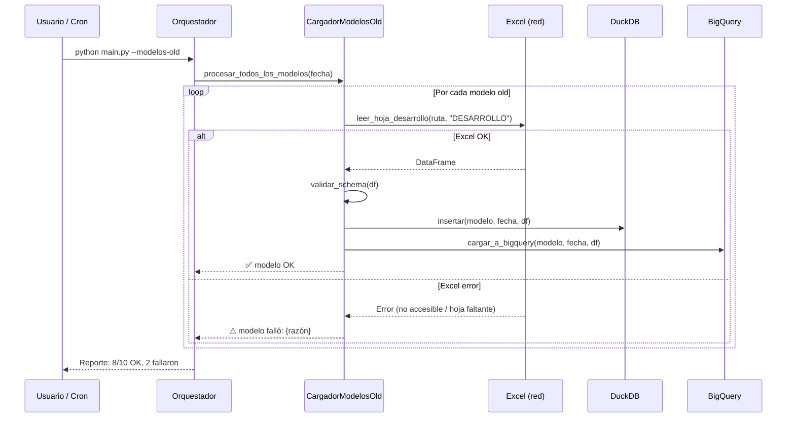

# F19 — Plan v2: Carga Modelos Old (Tablas de Desarrollo Legacy)

!!! warning "DRAFT — Requiere revisión"
    Este plan es un borrador que actualiza y refina el
    [Plan original v1](PLAN.md). Revisar con el equipo antes de
    continuar la implementación. Las fases 1-2 del plan original ya
    fueron completadas parcialmente en la rama `feat/carga-modelos-old`.

> **Feature ID:** F19  
> **Autor:** vlandaetat  
> **Fecha:** 2026-02-26  
> **Estado:** Draft — pendiente revisión  
> **Rama:** `feat/carga-modelos-old`  
> **Plan anterior:** [PLAN.md](PLAN.md) (v1, 2026-01-29)

---

## Resumen Ejecutivo

Los modelos de liquidez del banco se ejecutan diariamente. Algunos ya
están migrados a Python (inversiones, en proceso), pero la mayoría todavía
corren manualmente en Excel/VBA. Este feature busca:

1. **Leer diariamente** las tablas de desarrollo (output) de esos modelos
   legacy desde sus Excel en la red compartida
2. **Consolidar** en DuckDB local como respaldo
3. **Cargar a BigQuery** para tener la serie completa de todos los modelos
   en un solo lugar

### ¿Qué modelos son "old"?

Son todos los modelos que **no tienen implementación Python** y cuyo
output diario se genera manualmente:

| Modelo | Archivo Excel en red | Hoja(s) de interés |
|--------|---------------------|--------------------|
| Mora Consumo | `ML_Mora_Consumo.xlsm` | DESARROLLO |
| Mora CAE | `ML_Mora_CAE.xlsm` | DESARROLLO |
| Mora Hipotecario | `ML_Mora_Hipotecario.xlsm` | DESARROLLO |
| Mora Comercial | `ML_Mora_Comercial.xlsm` | DESARROLLO |
| Prepago Consumo | `MR_Prepago_Consumo.xlsm` | DESARROLLO |
| Prepago Hipotecario | `MR_Prepago_Hipotecario.xlsm` | DESARROLLO |
| Prepago CMR | `MR_Prepago_CMR.xlsm` | DESARROLLO |
| NMD | `ML_NMD.xlsm` | DESARROLLO |
| Línea de Crédito | `ML_LC.xlsm` | DESARROLLO |
| TC CMR | `ML_TC_CMR.xlsm` | DESARROLLO |

!!! note "A medida que se migran modelos a Python"
    Cuando un modelo se migra completamente a Python, se **retira** de
    esta lista. La carga diaria pasa a ser responsabilidad del pipeline
    Python directamente.

---

## Estado Actual (rama `feat/carga-modelos-old`)

### Completado

- [x] Estructura de directorios (`almacenamiento_local/`, `docs/feats/carga-modelos-old/`)
- [x] Dependencia `duckdb` en `requirements.txt`
- [x] `.gitignore` actualizado para `.duckdb` y `.db`
- [x] `config/config_modelos_old.yaml` con estructura base
- [x] `almacenamiento_local/__init__.py` importable
- [x] `almacenamiento_local/duckdb_manager.py` (CRUD básico)
- [x] `carga_modelos_gcp/cargar_modelos_old.py` (clase `CargadorModelosOld`)

### Pendiente

- [ ] Particionamiento por fecha en DuckDB
- [ ] Tests unitarios de DuckDB
- [ ] Completar configuración YAML con todas las rutas reales
- [ ] Validaciones de datos (schema, nulos)
- [ ] Integración con orquestador
- [ ] Tests de integración

---

## Diferencias con Plan v1

| Aspecto | Plan v1 | Plan v2 (este) |
|---------|---------|----------------|
| Foco | Infraestructura DuckDB + BQ | Completar pipeline end-to-end |
| Modelos | Lista pendiente de identificar | Lista completa definida arriba |
| Validación | Básica | Cruce con datos Python (si existen) |
| Orquestación | Item de fase 4 | Prioridad alta — debe correr autónomo |
| Relación con F18 | No existía | F18 cubre históricos, F19 cubre el día a día |

---

## Fases de Implementación (restantes)

### Fase A: Completar Configuración (0.5 día)

- [ ] **A.1 Obtener rutas reales de todos los Excel legacy**
    - Verificar accesibilidad de cada ruta desde la máquina de ejecución
    - Documentar rutas en `config/config_modelos_old.yaml`

- [ ] **A.2 Identificar hoja y schema de cada modelo**
    - Abrir cada Excel, verificar que hoja DESARROLLO existe
    - Documentar columnas de cada modelo (pueden variar ligeramente)
    - Definir schema mínimo común vs. schema extendido por modelo

- [ ] **A.3 Definir tabla BigQuery destino**
    - Nombre de tabla: `rf_modelos.desarrollo_modelos_old`
    - Schema: `fecha_proceso, modelo, timestamp_carga, ...columnas desarrollo`
    - Particionamiento por `fecha_proceso`

---

### Fase B: Robustecimiento del Lector (1 día)

- [ ] **B.1 Validaciones de datos**
    - Verificar que hoja DESARROLLO existe en el Excel
    - Validar schema mínimo (columnas obligatorias presentes)
    - Manejar nulos/vacíos: log warning, no crash
    - Detectar si las fechas en la hoja coinciden con la fecha esperada

- [ ] **B.2 Manejo de errores por modelo**
    - Un modelo que falla no detiene los otros
    - Reporte final: qué modelos cargaron OK, cuáles fallaron y por qué
    - Retry configurable (ej: si la red está lenta)

- [ ] **B.3 Detección de duplicados**
    - Antes de INSERT en BQ: verificar si ya existe `(fecha_proceso, modelo)`
    - Si existe: opción de sobrescribir (DELETE + INSERT) o skip
    - En DuckDB: UPSERT o INSERT OR REPLACE

---

### Fase C: Integración con Orquestador (0.5 día)

- [ ] **C.1 Agregar comando al orquestador**
    ```bash
    python main.py --modelos-old            # todos los modelos old
    python main.py --modelos-old mora_consumo nmd  # modelos específicos
    ```

- [ ] **C.2 Opcionalmente ejecutar después de modelos Python**
    ```bash
    python main.py --modelos ml_inversiones --modelos-old  # ambos
    ```

- [ ] **C.3 Logging integrado**
    - Usar el logger del orquestador (si F11 está implementado)
    - Si no, usar `print()` consistente con el resto del sistema

---

### Fase D: Tests y Validación (1 día)

- [ ] **D.1 Tests unitarios**
    - Test de DuckDBManager (inserción, lectura, duplicados)
    - Test de CargadorModelosOld con Excel mock
    - Test de validación de schema

- [ ] **D.2 Test de integración end-to-end**
    - Crear Excel mock con hoja DESARROLLO
    - Ejecutar pipeline completo: lectura → DuckDB → BigQuery (sandbox)
    - Verificar datos en ambos destinos

- [ ] **D.3 Prueba con datos reales**
    - Ejecutar con 1 modelo real (ej: Mora Consumo)
    - Verificar output en BigQuery
    - Comparar con datos que ya estén en BQ (si los hay)

---

### Fase E: Documentación y Merge (0.5 día)

- [ ] **E.1 Actualizar README con instrucciones de uso**
- [ ] **E.2 Documentar en MkDocs (esta página)**
- [ ] **E.3 Code review + merge a main**

---

## Flujo de Ejecución Diario



---

## Riesgos y Mitigaciones

| Riesgo | Probabilidad | Impacto | Mitigación |
|--------|-------------|---------|------------|
| Excel abierto por otro usuario (lock) | Alta | Medio | Lectura read-only con openpyxl (no necesita lock exclusivo) |
| Schema de hoja DESARROLLO cambia entre modelos | Media | Alto | Mapeo flexible por modelo en config YAML |
| Red compartida no disponible | Media | Alto | Retry + reporte de modelos fallidos |
| DuckDB y BQ quedan inconsistentes | Baja | Alto | Transacción: DuckDB primero, BQ después |
| Modelo migrado a Python pero no retirado de old | Media | Bajo | Check cruzado con lista de modelos Python activos |

---

## Estimación de Esfuerzo

| Fase | Duración | Dependencia |
|------|----------|-------------|
| Fase A: Configuración | 0.5 día | Acceso a red |
| Fase B: Robustecimiento | 1 día | Fase A |
| Fase C: Orquestador | 0.5 día | Fase B |
| Fase D: Tests | 1 día | Fase C |
| Fase E: Docs + Merge | 0.5 día | Fase D |
| **Total** | **3-4 días** | |

---

## Changelog del Plan

| Fecha | Autor | Cambio |
|-------|-------|--------|
| 2026-01-29 | vlandaetat | Plan v1 original |
| 2026-02-26 | vlandaetat | Plan v2: lista de modelos definida, fases recalibradas, integración con F18 |
