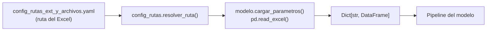

# F20 — Plan: Reestructura Sistema de Parámetros y Rutas

!!! warning "DRAFT — Requiere revisión"
    Este plan es un borrador. Revisar con el equipo antes de continuar.
    Ya existe trabajo previo en la rama
    `feature/reestructura-sistema-parametros-y-rutas` y un planning doc
    en `.planning/plan_reestructura_parametros_y_rutas.md`.

> **Feature ID:** F20  
> **Autor:** vlandaetat  
> **Fecha:** 2026-02-26  
> **Estado:** Draft — pendiente revisión  
> **Rama:** `feature/reestructura-sistema-parametros-y-rutas`  
> **Dependencia:** F02 (Snapshots de parámetros)

---

## Resumen Ejecutivo

Reemplazar los archivos Excel (`.xlsx`) que contienen parámetros de cada
modelo por archivos JSON con schema definido y validación automática.

### ¿Por qué cambiar?

| Problema con Excel | Impacto |
|---------------------|---------|
| **Binario, no diffable** | No se puede ver qué cambió en un commit de Git |
| **Sin validación de tipos** | Un espacio en blanco, un texto donde va un número — el modelo crashea sin mensaje claro |
| **Accidental edits** | Alguien abre el Excel, mueve una celda sin querer, lo guarda |
| **Estructura tabular forzada** | Los parámetros no siempre son tablas. A veces son listas, dicts, scalares, flags — Excel los fuerza a ser 2D |
| **No composable** | No puedes heredar o mergear parámetros de un escenario base + override |
| **Lectura lenta** | `pd.read_excel()` tarda 1-3 segundos por archivo vs. 5ms para JSON |

### ¿Qué queremos?

```json
{
  "$schema": "../schemas/prepago_consumo.json",
  "version": "1.0.0",
  "modelo": "mr_prepago_consumo",
  "parametros": {
    "smm_modelo": {
      "CONSUMO": [0.012, 0.015, 0.018, ...],
      "AUTOMOTRIZ": [0.008, 0.010, ...],
      "REFINANCIADO": [0.020, 0.022, ...]
    },
    "escenarios": {
      "BASE": { "descripcion": "Escenario base", "phi": 1.0 },
      "STRESS_1": { "descripcion": "Stress moderado", "phi": 1.25 },
      "STRESS_2": { "descripcion": "Stress severo", "phi": 1.50 }
    },
    "config": {
      "horizonte_dias": 360,
      "moneda": "CLP",
      "incluir_refinanciado": true
    }
  }
}
```

**Ventajas**:

- Diffable en Git (texto plano)
- Schema JSON valida tipos, rangos, campos obligatorios al cargar
- Soporta listas, dicts, strings, números, booleanos nativamente
- Composable: se puede hacer `base.json` + `override_stress.json`
- 200x más rápido de leer que Excel

---

## Estado Actual del Sistema de Parámetros

### Archivos de parámetros existentes

| Modelo | Archivo Excel | Hojas | Parámetros principales |
|--------|---------------|-------|------------------------|
| Prepago Consumo | `parametros_mr_prepago_consumo.xlsx` | SMM_PREPAGO, ESCENARIO | Vectores SMM por producto, escenarios (PHI) |
| Prepago Hipotecario | `parametros_mr_prepago_hipotecario.xlsx` | SMM_PREPAGO, ESCENARIO | Vectores SMM, escenarios |
| Prepago CMR | `parametros_mr_prepago_cmr.xlsx` | SMM_PREPAGO, ESCENARIO | Vectores SMM, escenarios |
| Mora Consumo | `parametros_ml_mora_consumo.xlsx` | 7 hojas | Factores mora, matrices por cartera |
| Mora CAE | `parametros_ml_mora_cae.xlsx` | 3 hojas | Factores mora, matriz CAE |
| Mora Hipotecario | `parametros_ml_mora_hipotecario.xlsx` | 3 hojas | Factores mora, matriz hipotecaria |
| Mora Comercial | `parametros_ml_mora_comercial.xlsx` | 3 hojas | Factores mora, matriz comercial |
| NMD | `parametros_ml_nmd.xlsx` | FACTORES | Factores NMD |
| Línea de Crédito | `parametros_ml_lc.xlsx` | FACTORES, LC_EGRESO | Factores LC, egresos |
| Inversiones | `RF_Parametros_ModeloInversiones.xlsm` *(red)* | 6 hojas | Factores CLP/CLF, FPL, MontoLiq |

### Cómo se cargan hoy



**Problemas observados en el código:**

1. `CargadorParametrosModelos` en `procesamiento_datos_input/cargador_parametros.py`
   tiene **solo 1 método activo** de 3 — los otros están comentados. Cada modelo
   carga sus parámetros **directamente** con `pd.read_excel()`.
2. `config_rutas.py` tiene funciones comentadas (`obtener_configuracion_modelos`,
   `agregar_rutas_al_path`) — intentos abandonados de centralizar.
3. No hay validación de tipos ni de schema en ningún punto.

---

## Arquitectura Propuesta

### Estructura de archivos

```
config/
├── schemas/                          # JSON Schemas por tipo de modelo
│   ├── prepago.schema.json           # Schema compartido para los 3 prepagos
│   ├── mora.schema.json              # Schema compartido para las 4 moras
│   ├── nmd.schema.json
│   ├── lc.schema.json
│   └── inversiones.schema.json
│
├── parametros/                       # Parámetros en JSON (nuevo)
│   ├── mr_prepago_consumo.json
│   ├── mr_prepago_hipotecario.json
│   ├── mr_prepago_cmr.json
│   ├── ml_mora_consumo.json
│   ├── ml_mora_cae.json
│   ├── ml_mora_hipotecario.json
│   ├── ml_mora_comercial.json
│   ├── ml_nmd.json
│   ├── ml_lc.json
│   └── ml_inversiones.json           # Parámetros locales (no los de red)
│
└── cargador_parametros.py            # Nuevo cargador unificado
```

### Cargador unificado

```python
class CargadorParametros:
    """Carga parámetros desde JSON con validación de schema."""

    def __init__(self, ruta_json: Path, ruta_schema: Optional[Path] = None):
        self.ruta_json = ruta_json
        self.ruta_schema = ruta_schema

    def cargar(self) -> dict:
        """Lee JSON, valida contra schema, retorna dict."""
        datos = json.loads(self.ruta_json.read_text(encoding='utf-8'))
        if self.ruta_schema:
            self._validar_schema(datos)
        return datos['parametros']

    def _validar_schema(self, datos: dict) -> None:
        """Valida contra JSON Schema. Raise en error."""
        schema = json.loads(self.ruta_schema.read_text(encoding='utf-8'))
        jsonschema.validate(datos, schema)  # fail-fast
```

### Modo dual (transición)

Durante la migración, el cargador soportará ambos formatos:

```python
def cargar_parametros(modelo: str) -> dict:
    ruta_json = config.PARAMETROS_DIR / f"{modelo}.json"
    ruta_excel = config.PARAMETROS_DIR / f"parametros_{modelo}.xlsx"

    if ruta_json.exists():
        return CargadorParametros(ruta_json).cargar()
    elif ruta_excel.exists():
        logger.warning(f"Usando fallback Excel para {modelo}")
        return cargar_desde_excel(ruta_excel)  # legacy
    else:
        raise FileNotFoundError(f"No hay parámetros para {modelo}")
```

---

## Fases de Implementación

### Fase 1: Definición de Schemas (1-2 días)

**Objetivo**: Analizar los Excel actuales y definir schemas JSON.

- [ ] **1.1 Auditar cada Excel de parámetros**
    - Abrir cada archivo, documentar todas las hojas
    - Por hoja: columnas, tipos de datos, rangos válidos
    - Identificar parámetros que son realmente escalares/listas/dicts forzados en tabular

- [ ] **1.2 Diseñar estructura JSON por modelo**
    - Definir cómo se representan vectores SMM (array JSON)
    - Definir cómo se representan matrices de mora (array de arrays o dict de dicts)
    - Definir cómo se representan escenarios (dict con campos tipados)
    - Documentar decisiones en este plan

- [ ] **1.3 Escribir JSON Schemas**
    - Usar JSON Schema draft 2020-12
    - Definir: `type`, `required`, `minimum/maximum`, `enum`, `pattern`
    - Ejemplo: `"phi": {"type": "number", "minimum": 0, "maximum": 10}`
    - Reutilizar definiciones compartidas con `$ref` (ej: schema de escenarios)

- [ ] **1.4 Crear 1-2 JSON de ejemplo y validar**
    - Convertir manualmente `parametros_mr_prepago_consumo.xlsx` a JSON
    - Validar contra schema con `jsonschema` library
    - Verificar que el modelo funciona igual con JSON que con Excel

??? question "Decisiones a tomar en esta fase"
    - ¿Agrupar schemas por familia (prepago, mora) o uno por modelo?
    - ¿Los vectores SMM se guardan como arrays JSON `[0.012, 0.015, ...]` o
      como dict `{"mes_1": 0.012, "mes_2": 0.015, ...}`?
    - ¿Las matrices de mora se guardan como array 2D o como dict de dicts?
    - ¿Incluir metadata en el JSON? (versión, autor, fecha edición)
    - ¿Un campo `descripcion` por parámetro (como documentación inline)?

---

### Fase 2: Herramienta de Migración Excel→JSON (1 día)

**Objetivo**: Script automático para convertir Excel existentes a JSON.

- [ ] **2.1 Implementar `tools/excel_a_json.py`**
    ```bash
    python tools/excel_a_json.py \
        --excel parametros_mr_prepago_consumo.xlsx \
        --schema config/schemas/prepago.schema.json \
        --output config/parametros/mr_prepago_consumo.json
    ```

- [ ] **2.2 Lógica de conversión por tipo de hoja**
    - Hoja tabular simple → dict de listas
    - Hoja tipo clave-valor → dict plano
    - Hoja tipo matriz → array 2D o dict de dicts
    - Manejar celdas vacías, tipos mixtos, headers con espacios

- [ ] **2.3 Convertir los 9 Excel locales**
    - Ejecutar script para cada modelo
    - Validar cada JSON contra su schema
    - Comitear JSONs al repo

- [ ] **2.4 Parámetros de Inversiones (caso especial)**
    - El Excel vive en la red, no en el repo
    - Opción A: Extraer los parámetros que no cambian frecuentemente a JSON local
    - Opción B: Mantener lectura de red + snapshot (F02)
    - Decisión pendiente

---

### Fase 3: Cargador Unificado + Modo Dual (1-2 días)

**Objetivo**: Implementar el nuevo cargador y activarlo gradualmente.

- [ ] **3.1 Implementar `config/cargador_parametros.py` (nuevo)**
    - `CargadorParametros` con validación de schema
    - `cargar_parametros(modelo)` con fallback Excel→JSON
    - Logging de qué fuente se usó

- [ ] **3.2 Migrar modelo piloto: Prepago Consumo**
    - Reemplazar `pd.read_excel()` directo por `cargar_parametros('mr_prepago_consumo')`
    - Verificar que el output es idéntico (byte-por-byte en Excel de salida)
    - Documentar cambios necesarios en el modelo

- [ ] **3.3 Migrar segundo modelo: Mora CAE**
    - Confirmar que el patrón funciona para modelos de mora (más complejos)
    - Ajustar cargador si necesario

- [ ] **3.4 Migrar resto de modelos (batch)**
    - Una vez confirmado el patrón, migrar los 7 restantes
    - Cada migración: crear JSON, usar cargador, verificar output
    - Mantener Excel como fallback hasta que todos estén migrados

---

### Fase 4: Limpieza y Eliminación del Código Legacy (0.5 día)

- [ ] **4.1 Eliminar `CargadorParametrosModelos` viejo**
    - Borrar `procesamiento_datos_input/cargador_parametros.py` o refactorizar
    - Eliminar código comentado en `config_rutas.py`

- [ ] **4.2 Eliminar fallback Excel del cargador**
    - Una vez todos los modelos usen JSON, remover el modo dual
    - Mover Excel a carpeta `legacy/` o eliminar

- [ ] **4.3 Actualizar YAML de configuración**
    - Campo `excel_parametros_input` → `json_parametros` (o eliminar si es path convencional)

- [ ] **4.4 Actualizar documentación**
    - README, MkDocs, docstrings

---

## Ejemplo: Migración de Prepago Consumo

### Antes (Excel)

Hoja `SMM_PREPAGO`:

| PRODUCTO | MES_1 | MES_2 | MES_3 | ... |
|----------|-------|-------|-------|-----|
| CONSUMO | 0.012 | 0.015 | 0.018 | ... |
| AUTOMOTRIZ | 0.008 | 0.010 | 0.012 | ... |

Hoja `ESCENARIO`:

| ESCENARIO | DESCRIPCION | PHI |
|-----------|-------------|-----|
| BASE | Escenario base | 1.00 |
| STRESS_1 | Stress moderado | 1.25 |

### Después (JSON)

```json
{
  "$schema": "../schemas/prepago.schema.json",
  "version": "1.0.0",
  "modelo": "mr_prepago_consumo",
  "fecha_actualizacion": "2026-02-26",
  "parametros": {
    "smm_modelo": {
      "CONSUMO": [0.012, 0.015, 0.018],
      "AUTOMOTRIZ": [0.008, 0.010, 0.012]
    },
    "escenarios": {
      "BASE": {
        "descripcion": "Escenario base",
        "phi": 1.0
      },
      "STRESS_1": {
        "descripcion": "Stress moderado",
        "phi": 1.25
      }
    }
  }
}
```

### Schema

```json
{
  "$schema": "https://json-schema.org/draft/2020-12/schema",
  "type": "object",
  "required": ["modelo", "parametros"],
  "properties": {
    "modelo": {
      "type": "string",
      "pattern": "^m[rl]_"
    },
    "parametros": {
      "type": "object",
      "required": ["smm_modelo", "escenarios"],
      "properties": {
        "smm_modelo": {
          "type": "object",
          "additionalProperties": {
            "type": "array",
            "items": { "type": "number", "minimum": 0, "maximum": 1 }
          }
        },
        "escenarios": {
          "type": "object",
          "additionalProperties": {
            "type": "object",
            "required": ["descripcion", "phi"],
            "properties": {
              "descripcion": { "type": "string" },
              "phi": { "type": "number", "minimum": 0 }
            }
          }
        }
      }
    }
  }
}
```

---

## Relación con Otras Features

| Feature | Relación |
|---------|----------|
| **F02 (Snapshots)** | Prerequisito. Los snapshots existentes copian Excel; post-migración copiarían JSON (más liviano, más rápido) |
| **F07 (Params como Código)** | F20 es el **primer paso concreto** de F07. F07 es la visión completa (YAML versionado, CI validation), F20 es el cambio de formato |
| **F12 (Config Unificada)** | Complementario. F12 unifica la config del sistema; F20 unifica los parámetros de modelos |

---

## Riesgos y Mitigaciones

| Riesgo | Probabilidad | Impacto | Mitigación |
|--------|-------------|---------|------------|
| Conversión Excel→JSON pierde precisión numérica | Baja | Alto | Comparar output modelo con ambas fuentes (Fase 3.2) |
| Equipo no adopta JSON (prefiere editar Excel) | Media | Alto | Excel viewer generado desde JSON (Power Query o script) |
| Matrices de mora demasiado complejas para JSON | Baja | Medio | Alternativa: archivos CSV complementarios o arrays compactos |
| Schema demasiado restrictivo frena cambios de parámetros | Media | Medio | Schema permisivo al inicio, endurecer gradualmente |
| Inversiones usa Excel remoto con 6 hojas tabulares complejas | Alta | Medio | Caso especial: mantener lectura de red + snapshot, decidir después |

---

## Dependencias Técnicas

- **`jsonschema`**: Library Python para validación JSON Schema. Ya disponible
  en pip, ligera, sin dependencias pesadas.
- **`json`**: Stdlib Python, sin dependencias externas.
- **Rama existente**: `feature/reestructura-sistema-parametros-y-rutas` tiene
  un commit de planificación. El trabajo de código empezaría aquí.

---

## Estimación de Esfuerzo

| Fase | Duración | Dependencia |
|------|----------|-------------|
| Fase 1: Schemas | 1-2 días | Acceso a Excel de parámetros |
| Fase 2: Migración | 1 día | Fase 1 |
| Fase 3: Cargador + rollout | 1-2 días | Fase 2 |
| Fase 4: Limpieza | 0.5 día | Fase 3 (todos los modelos OK) |
| **Total** | **3-5 días** | |

---

## Changelog del Plan

| Fecha | Autor | Cambio |
|-------|-------|--------|
| 2026-02-26 | vlandaetat | Creación inicial del plan (draft) |
