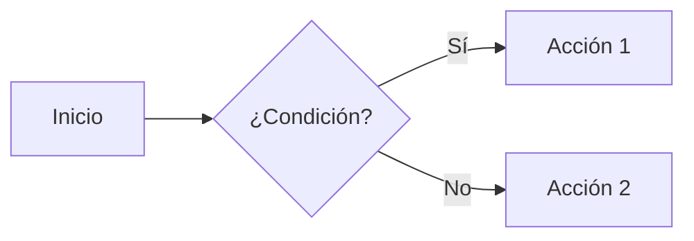

# Mermaid Local: Diagramas en MkDocs detrás de proxy corporativo

!!! abstract "TL;DR"
    Los diagramas mermaid no renderizan por defecto detrás del proxy corporativo.
    La solución es descargar `mermaid.min.js` localmente e inyectarlo **antes** del
    bundle del tema via template override.

---

## El problema

Al usar bloques ` ```mermaid ` en archivos `.md`, MkDocs Material renderiza diagramas
(Gantt, flowchart, sequence, etc.) usando la librería [mermaid.js](https://mermaid.js.org/).

En nuestro entorno corporativo (Falabella), los diagramas **no se renderizan** y aparecen
como bloques de texto plano. La consola del navegador muestra errores de carga de scripts.

### ¿Por qué ocurre?

El bundle JS de **mkdocs-material 9.6.x** contiene esta lógica (minificada):

```javascript
// Pseudo-código del bundle de mkdocs-material
function cargarMermaid() {
  if (typeof mermaid === "undefined" || mermaid instanceof Element) {
    // mermaid NO está disponible → cargar desde CDN
    cargarScript("https://unpkg.com/mermaid@11/dist/mermaid.min.js");
  } else {
    // mermaid YA está disponible → usar el global
    return mermaid;
  }
}
```

Es decir: el tema **no empaqueta** mermaid.js — lo carga dinámicamente desde `unpkg.com`
cuando detecta bloques `<pre class="mermaid">` en la página.

**El proxy corporativo bloquea `unpkg.com`** (y `cdn.jsdelivr.net`), devolviendo
una página HTML de error en vez del JavaScript. Resultado: mermaid nunca se carga,
los diagramas nunca se renderizan.

---

## Intentos que NO funcionaron

Documentamos los intentos fallidos para evitar repetirlos:

### 1. `extra_javascript` con URL de CDN

```yaml
# mkdocs.yml — NO FUNCIONA
extra_javascript:
  - https://unpkg.com/mermaid@11/dist/mermaid.min.js
```

**Falla porque**: El navegador intenta cargar el JS directamente desde el CDN,
el proxy lo bloquea igual que al bundle del tema.

### 2. `extra_javascript` con archivo local

```yaml
# mkdocs.yml — NO FUNCIONA
extra_javascript:
  - javascripts/mermaid.min.js
```

**Falla porque**: Los scripts en `extra_javascript` se inyectan **DESPUÉS** del bundle
del tema en el HTML. El bundle se ejecuta primero, evalúa `typeof mermaid === "undefined"`
(verdadero, porque nuestro script aún no cargó), e intenta cargar desde unpkg.com → falla.

### 3. `fence_mermaid_format` en superfences

```yaml
# mkdocs.yml — NO FUNCIONA (pymdownx < 10.x)
markdown_extensions:
  - pymdownx.superfences:
      custom_fences:
        - name: mermaid
          class: mermaid
          format: !!python/name:pymdownx.superfences.fence_mermaid_format
```

**Falla porque**: `fence_mermaid_format` no existe en la versión de pymdownx instalada.
El formato correcto para nuestra versión es `fence_code_format`.

### 4. `curl -k -L` desde terminal

```bash
# NO FUNCIONA — devuelve HTML del proxy, no JS
curl -k -L -o mermaid.min.js "https://cdn.jsdelivr.net/npm/mermaid@11/dist/mermaid.min.js"
# Resultado: archivo de 44KB con HTML del proxy, no 3.3MB de JS
```

**Falla porque**: `curl` pasa por el proxy que intercepta la conexión SSL y devuelve
su propia página HTML de error/redirección.

### 5. Python `urllib` con SSL deshabilitado

```python
import urllib.request, ssl
ctx = ssl.create_default_context()
ctx.check_hostname = False
ctx.verify_mode = ssl.CERT_NONE
urllib.request.urlopen(url, context=ctx)  # → HTTP 403 Forbidden
```

**Falla porque**: Aunque se deshabilita la verificación SSL, el proxy retorna 403.

### 6. `pip download mermaid-py`

**Falla porque**: El paquete `mermaid-py` de PyPI es un wrapper Python, no contiene
el archivo `mermaid.min.js`.

---

## La solución que SÍ funciona

La solución tiene dos partes:

### Parte 1: Descargar `mermaid.min.js` localmente

El módulo `requests` con `verify=False` desde el conda env sí puede alcanzar
`cdnjs.cloudflare.com` (a diferencia de jsdelivr y unpkg que devuelven 403):

```bash
conda activate bfa-cl-modelos
python docs/javascripts/descargar_mermaid.py
```

El script descarga `mermaid.min.js` (~3.3 MB) a `docs/javascripts/mermaid.min.js`.

!!! tip "¿Por qué `requests` con `verify=False` funciona?"
    El proxy corporativo usa certificados auto-firmados para inspección SSL.
    `pip` funciona con PyPI porque tiene `trusted-host` configurado.
    `requests` con `verify=False` acepta cualquier certificado, incluyendo
    los del proxy, y `cdnjs.cloudflare.com` no es bloqueado por la política
    de filtrado (a diferencia de jsdelivr y unpkg que sí lo son).

### Parte 2: Template override para cargar antes del bundle

El archivo `docs/overrides/main.html` inyecta mermaid **antes** del bundle:

```html+jinja
{# docs/overrides/main.html #}


  <script src="{{ 'javascripts/mermaid.min.js' | url }}"></script>
  {{ super() }}

```

Esto produce en el HTML final:

```html
<!-- 1. Primero: nuestro mermaid.min.js (local) -->
<script src="../javascripts/mermaid.min.js"></script>

<!-- 2. Después: el bundle del tema -->
<script src="../assets/javascripts/bundle.XXXX.min.js"></script>
```

Cuando el bundle evalúa `typeof mermaid`, encuentra que **ya está definido**
(porque nuestro script cargó primero) y **usa el global** en vez de intentar
descargarlo desde unpkg.com.

!!! success "¿Por qué funciona?"
    El bundle del tema tiene un condicional: si `mermaid` ya existe como global
    de JavaScript, lo usa directamente. Al cargarlo antes del bundle vía template
    override, el tema lo encuentra y lo usa sin intentar cargar desde CDN.

---

## Configuración en `mkdocs.yml`

```yaml
theme:
  name: material
  custom_dir: docs/overrides  # ← habilita template overrides
  # ... resto del tema

markdown_extensions:
  - pymdownx.superfences:
      custom_fences:
        - name: mermaid
          class: mermaid
          format: !!python/name:pymdownx.superfences.fence_code_format

extra_javascript: []  # ← vacío, mermaid se carga via override
```

!!! warning "No usar `extra_javascript` para mermaid"
    Los scripts de `extra_javascript` se cargan **después** del bundle del tema.
    Si pones mermaid ahí, el bundle intentará cargarlo desde CDN antes de que
    tu script local esté disponible.

---

## Estructura de archivos

```
docs/
├── overrides/
│   └── main.html                  # Template override (carga mermaid antes del bundle)
├── javascripts/
│   ├── mermaid.min.js             # Mermaid JS local (~3.3 MB, mermaid 10.9.3)
│   └── descargar_mermaid.py       # Script para descargar/actualizar mermaid.min.js
└── guia/
    └── mermaid-local.md           # Esta documentación
```

---

## Cómo usar mermaid en cualquier `.md`

Una vez configurado, simplemente usa bloques de código con lenguaje `mermaid`:

````markdown

````

Tipos de diagramas soportados:

| Tipo | Keyword | Ejemplo |
|---|---|---|
| Flowchart | `graph` o `flowchart` | `graph LR; A-->B` |
| Sequence | `sequenceDiagram` | Diagramas de secuencia |
| Gantt | `gantt` | `gantt; title Mi Plan` |
| Class | `classDiagram` | Diagramas de clases |
| State | `stateDiagram-v2` | Máquinas de estado |
| ER | `erDiagram` | Entidad-relación |
| Pie | `pie` | Gráficos circulares |
| Git Graph | `gitGraph` | Visualización de branches |

Referencia completa: [mermaid.js.org/syntax](https://mermaid.js.org/syntax/)

---

## Actualizar mermaid.js

Para actualizar a una nueva versión:

1. Editar `VERSION` en `docs/javascripts/descargar_mermaid.py`
2. Ejecutar:
   ```bash
   conda activate bfa-cl-modelos
   python docs/javascripts/descargar_mermaid.py
   ```
3. Reiniciar `mkdocs serve`

---

## Troubleshooting

### Los diagramas aparecen como texto plano

1. Verificar que `docs/javascripts/mermaid.min.js` existe y pesa ~3 MB
2. Verificar que `docs/overrides/main.html` existe
3. Verificar que `mkdocs.yml` tiene `custom_dir: docs/overrides`
4. Reiniciar `mkdocs serve`

### Error de sintaxis en el diagrama

Mermaid muestra un cuadro rojo con el error. Verificar la sintaxis en el
[editor online de mermaid](https://mermaid.live/) (desde un equipo con
acceso a internet sin restricciones).

### Actualicé mkdocs-material y dejó de funcionar

Si el tema cambia su bundle, verificar que el override siga siendo compatible.
El bloque `` es estable en mkdocs-material.
Reconstruir con `mkdocs build` y verificar en el HTML que mermaid.min.js
aparece ANTES del bundle.

```bash
grep -n "mermaid.min.js\|bundle.*\.js" site/roadmap/index.html
# Debe mostrar mermaid PRIMERO, bundle DESPUÉS
```
