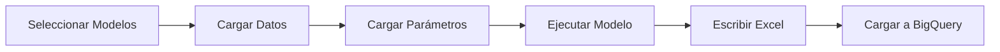

# Uso Básico

> **Autor:** vlandaetat  
> **Fecha de creación:** 2026-01-29  
> **Última edición por:** vlandaetat  
> **Fecha última edición:** 2026-01-29

---

## Interfaz Gráfica

La forma más sencilla de usar el sistema es mediante la interfaz gráfica:

```bash
python main.py
```

Esto abrirá una ventana donde podrás:

1. Seleccionar los modelos a ejecutar
2. Configurar la fecha de proceso
3. Iniciar la ejecución
4. Ver el progreso en tiempo real

## Ejecución por Línea de Comandos

También puedes ejecutar modelos desde la terminal:

```bash
# Ejecutar un modelo específico
python -m RF_Modelo_Prepago_Consumo.mr_prepago_consumo

# Ejecutar el orquestador
python -m core.orquestador
```

## Flujo de Ejecución



## Outputs

Cada modelo genera:

1. **Archivo Excel** (`.xlsm`) con:
   - Hoja de resultados
   - Hoja de desarrollo
   - Macros de actualización

2. **Tabla en BigQuery** con:
   - Resultados del modelo
   - Fecha de ejecución
   - Metadatos

## Logs

Los logs se guardan en `logs/` con formato:

```
logs/
├── 2026-01-29_ejecucion.log
└── 2026-01-29_errores.log
```
