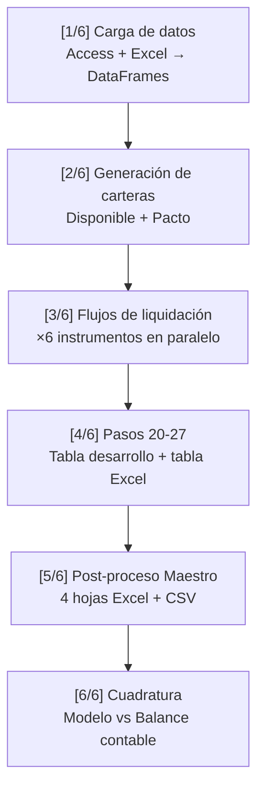
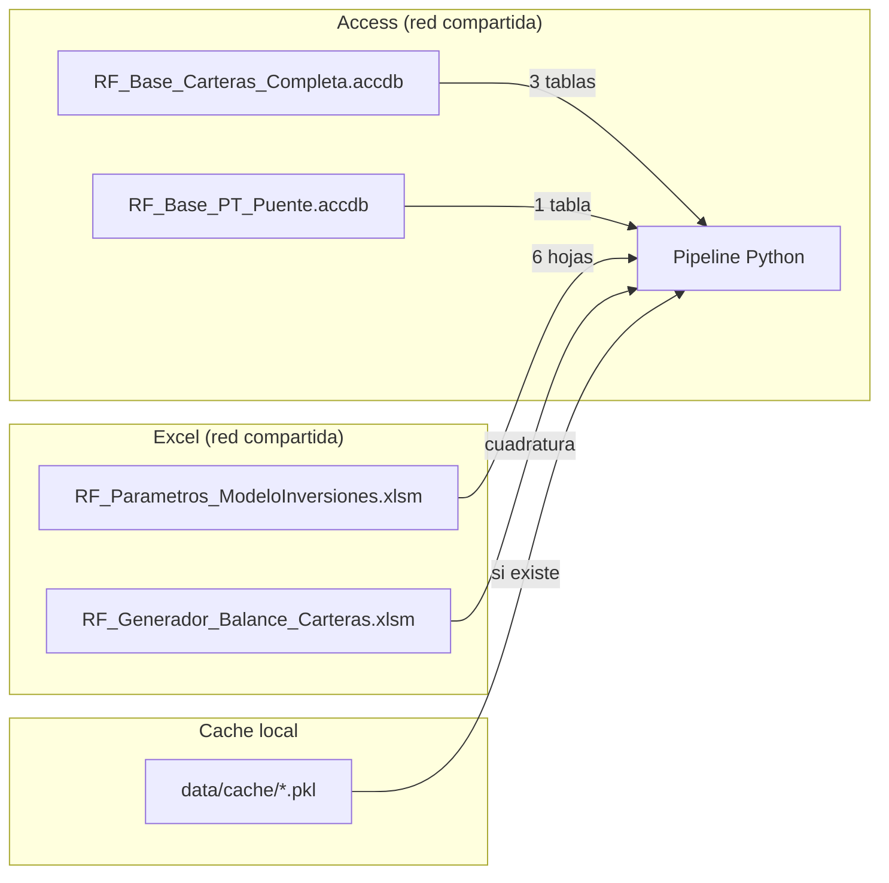
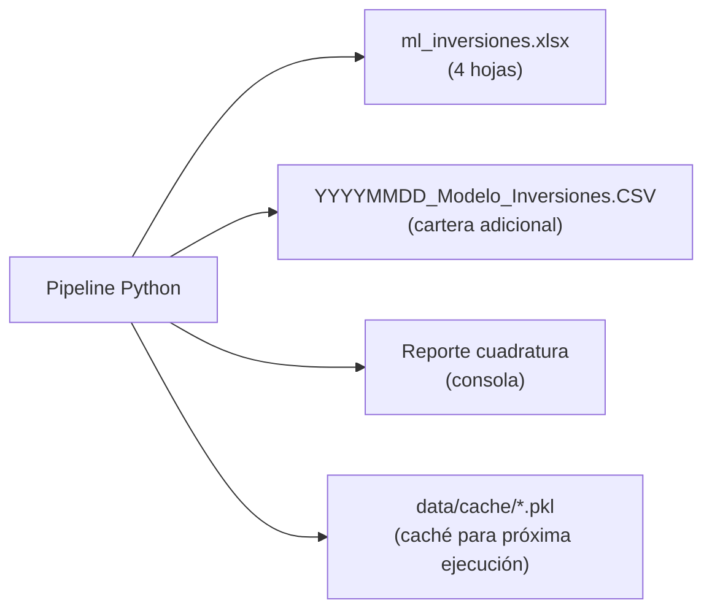

# Modelo de Inversiones

!!! abstract "Resumen"
    El Modelo de Inversiones estima los flujos de liquidación diarios de la
    cartera de renta fija de Banco Falabella, desagregado por instrumento
    financiero (bonos de gobierno, depósitos a plazo, corporativos). Es el
    modelo más complejo del sistema y el primero en ser migrado del Excel/VBA
    original a Python puro.

---

## Contexto de negocio

### ¿Qué hace este modelo?

El banco mantiene una cartera de inversiones en instrumentos de renta fija
(bonos del gobierno, depósitos a plazo, bonos corporativos, etc.). La gestión
de liquidez requiere estimar **cuánto dinero se libera cada día** por
vencimiento o liquidación de estos instrumentos durante un horizonte de 30 días.

El modelo toma la cartera vigente al cierre del día, aplica factores de
liquidación (haircuts) según el tipo de instrumento y plazo, y genera un
perfil diario de flujos de caja esperados en CLP.

### Instrumentos soportados

| Clave   | Instrumento                      | Moneda | Nemotécnicos           |
|---------|----------------------------------|--------|------------------------|
| GobCLP  | Bonos de Gobierno en pesos       | CLP    | BCP, BTP, PDB          |
| GobCLF  | Bonos de Gobierno en UF          | CLF    | BCU, BTU (+ CER pacto) |
| DPF     | Depósitos a Plazo Fijo           | CLP    | DPF (+ FFM pacto)      |
| DPR     | Depósitos a Plazo Reajustable    | CLF    | DPR                    |
| BBC     | Bonos Bancarios Corporativos CLP | CLP    | BBC                    |
| LCH     | Letras Crédito Hipotecario + BBC CLF | CLF | LCH, BBC (filtro CLF) |

Cada instrumento tiene su propia configuración de códigos, factores de
descuento y parámetros de Floor Piso Liquidez (FPL). La configuración
se centraliza en [config/instrumentos.py](../../RF_Modelo_Inversiones/config/instrumentos.py).

!!! info "Instrumentos futuros"
    El modelo tiene soporte preparado para **DPX** (depósitos en dólares, moneda USD)
    que está comentado en la configuración. Cuando el banco opere depósitos en
    USD, solo se necesita descomentar la entrada y agregar la tabla de factores
    `RF_FactUSD_Banc`.

---

## Arquitectura del código

### Estructura de carpetas

```
RF_Modelo_Inversiones/
├── ml_inversiones.py          # Entry point principal (6 etapas del pipeline)
├── run_validacion.py          # Script de validación independiente
├── __init__.py
│
├── config/
│   ├── __init__.py
│   └── instrumentos.py        # Configuración centralizada de instrumentos (dataclass)
│
├── io/
│   ├── __init__.py
│   ├── data_sources.py        # Abstracción multi-fuente (Pickle/Access/BigQuery)
│   └── cache.py               # Sistema de caché genérico con pickle
│
├── pipeline/
│   ├── __init__.py
│   ├── orquestador.py         # Orquesta el pipeline de liquidación por instrumento
│   ├── cartera.py             # Generación de carteras (disponible y pacto)
│   ├── liquidacion.py         # Cálculo de montos totales, ponderadores y flujos
│   ├── haircut.py             # Aplicación de factores de haircut
│   ├── agregaciones.py        # Funciones genéricas de GROUP BY + SUM
│   └── post_proceso.py        # Cuadratura contra balance contable
│
├── output/
│   ├── __init__.py
│   ├── tabla_final.py         # Pasos 20-27 (tabla desarrollo, precios UF, UNION flujos)
│   ├── excel_writer.py        # Generación de Excel con 4 hojas + RepasaCodigo
│   └── cartera_adicional.py   # Hoja CartAdcnl (54 cols) + CSV
│
├── tests/                     # 192 tests unitarios
│   ├── test_agregaciones.py       (18 tests)
│   ├── test_cache.py              (22 tests)
│   ├── test_cartera.py            (18 tests)
│   ├── test_config_instrumentos.py (43 tests)
│   ├── test_haircut.py            (17 tests)
│   ├── test_liquidacion.py        (18 tests)
│   ├── test_orquestador.py        (17 tests)
│   └── test_tabla_final.py        (39 tests)
│
├── parametros/                # Carpeta para parámetros locales
└── output/                    # Archivos de salida generados
```

### Decisiones de diseño clave

#### 1. Migración desde Access + VBA

El modelo original vivía en:

- **Access (`.accdb`)**: Queries encadenadas (`RF_PLI_001`, `RF_PLI_002`, ..., `RF_PLI_050`)
  que filtraban, unían y transformaban la cartera de inversiones.
- **Excel (`.xlsm`)**: "Maestro Modelo de Inversiones" con macros VBA
  (`ActualizaModeloInversiones`, `RepasaCodigoSubProducto`, `CarteraAdicional`) que
  orquestaban el proceso, generaban el output final y hacían cuadratura.

**Decisión**: Migrar toda la lógica a Python puro, manteniendo trazabilidad
con las queries SQL originales (documentadas en docstrings como "SQL de referencia")
para que cualquier analista pueda mapear el código Python a la lógica original de Access.

**Razón**: Access no soporta automatización, tiene límites de escala, no es
versionable con Git, y la macro VBA era frágil ante cambios de estructura.

#### 2. Configuración centralizada con dataclasses

Cada instrumento se define como un `ConfigInstrumento` (frozen dataclass) en
[config/instrumentos.py](../../RF_Modelo_Inversiones/config/instrumentos.py)
con validación automática al instanciar:

```python
@dataclass(frozen=True)
class ConfigInstrumento:
    nombre_completo: str
    codigos_disp: List[str]
    codigos_pacto: List[str]
    moneda: str
    tabla_factores: str
    instrumento_fpl: str
    instrumento_montos_liq: str
    nombre_salida: str
    cod_sub_pro_final: str
    filtro_moneda: Optional[str] = None
    activo: bool = True
```

**Razón**: El modelo original tenía la configuración de cada instrumento
**duplicada** en múltiples funciones con parámetros hardcodeados. Al centralizar
en un dataclass `frozen=True`:

- Es imposible modificar la configuración accidentalmente en runtime
- La validación en `__post_init__` detecta errores de configuración al importar
  (ej: moneda inválida, prefijo de tabla incorrecto)
- Agregar un nuevo instrumento es agregar una entrada al diccionario `INSTRUMENTOS`

#### 3. Abstracción de fuentes de datos (multi-mode I/O)

El módulo `io/data_sources.py` soporta tres modos de carga:

| Modo       | Fuente                  | Uso típico                |
|------------|-------------------------|---------------------------|
| `PICKLE`   | Cache pickle local      | Desarrollo rápido         |
| `LIVE`     | Access `.accdb` + Excel | Producción actual         |
| `BIGQUERY` | BigQuery GCS            | Producción futura en GCP  |

```python
tablas = cargar_tablas_ml_inversiones(
    fecha_proceso=20260219,
    modo=DataSourceMode.LIVE,  # o PICKLE, BIGQUERY
)
```

**Razón**: La lectura desde Access es lenta (~2 min) y requiere driver ODBC.
Al abstraer la fuente, el desarrollo/testing usa pickles instantáneamente,
producción lee de Access, y la migración a BigQuery no requiere cambiar el
pipeline — solo el modo de carga.

#### 4. Sistema de caché con pickle

El módulo `io/cache.py` implementa caché automático:

- Primera ejecución: lee de Access, guarda pickle en `data/cache/`
- Ejecuciones siguientes: carga pickle instantáneamente
- Patrón de nombre: `{nombre}_{fecha}_{timestamp}.pkl`
- Auto-limpieza: mantiene máximo 5 pickles por fecha
- Flag `--forzar-recarga` para invalidar

**Razón**: Access tarda ~2 minutos en cargar todas las tablas. El caché
reduce el tiempo de desarrollo de minutos a segundos.

#### 5. Pipeline parametrizado por instrumento

En vez de tener 6 funciones separadas (una por instrumento), todo el pipeline
de liquidación está parametrizado:

```python
def generar_flujo_liquidacion_instrumento(
    df_cartera_inv, df_cartera_inv_pacto, tablas,
    tipo_instrumento='GobCLP',  # ← cambia el instrumento
    fecha_proceso=20260219,
)
```

El pipeline ejecuta 10 pasos idénticos para cada instrumento, usando
la configuración del diccionario `INSTRUMENTOS` para parametrizar filtros,
códigos y tablas. Esto eliminó ~3,000 líneas de código duplicado.

#### 6. Funciones de agregación genéricas

`pipeline/agregaciones.py` unifica la lógica repetida de GROUP BY + SUM:

```python
# En vez de 3 funciones separadas con la misma lógica:
df_total = agregar_por_columnas(
    df, cols_grupo='Instrumento',
    cols_suma=['VP_Cap_Amort', 'VP_Int_Total'],
    col_total='VP_Flujo'
)
```

#### 7. Trazabilidad SQL ↔ Python

Cada función incluye el SQL original de Access en su docstring:

```python
def generar_cartera_pond(...):
    """
    SQL de referencia:
        SELECT RF_CarteraGobCLP.*,
               (VP_Cap_Amort + VP_Int_Total) / VP_Flujo AS Ponderador
        FROM RF_CarteraGobCLP
        INNER JOIN RF_CarteraGobCLP_MonTotal ON Cod_Pro AND Moneda;
    """
```

**Razón**: Permite a cualquier analista que conozca el modelo de Access
entender qué hace cada función sin necesidad de aprender Python.

---

## Pipeline: paso a paso

El modelo ejecuta 6 etapas secuenciales:



### Etapa 1: Carga de datos

Carga ~12 tablas desde dos archivos Access y un Excel de parámetros:

**Desde Access** (`RF_Base_Carteras_Completa.accdb`):

- `RF_base_Completa_Hist_Input` → se filtra para generar `RF_base_Completa_Hist`
- `RF_BD_Gestion_RM`
- `RF_Cartera_RtaFija_Hist`

**Desde Access** (`RF_Base_PT_Puente.accdb`):

- `RF_Base_Diaria_Precios`

**Desde Excel** (`RF_Parametros_ModeloInversiones.xlsm`):

- `FPL` — Floor Piso Liquidez (haircuts mínimos por instrumento)
- `RF_FactCLP_Gob` / `RF_FactCLF_Gob` — Factores de descuento gobierno
- `RF_FactCLP_Banc` / `RF_FactCLF_Banc` — Factores de descuento bancarios
- `RF_MontosLiq` — Montos a liquidar por instrumento

El filtrado de `RF_base_Completa_Hist` excluye:

- Registros con `Fec_Pro` más de 10 días antes de la fecha proceso
- Registros donde `Cod_Pro` contiene "publico" **y** `Clasificacion_Contable` es "HTM"

### Etapa 2: Generación de carteras

Produce dos carteras a partir de `RF_base_Completa_Hist`:

**Cartera Disponible** (`genera_cartera_inv(tipo='disponible')`):

- Filtra por `Cod_Sub_Pro` terminado en `Disp`, `Disp_Liq` o `MUTUOS`
- Excluye instrumentos LCH (se procesan aparte)
- Excluye clasificación contable HTM
- Transforma fondos mutuos a "Inversion Financiera Privado"

**Cartera Pacto** (`genera_cartera_inv(tipo='pacto')`):

- Filtra por `Cod_Sub_Pro` terminado en `Pcto` o `Pcto_Liq`
- Incluye columna adicional `Dias_Pacto`
- Sin exclusiones de LCH ni HTM

### Etapa 3: Flujos de liquidación (×6 instrumentos)

Para **cada instrumento** (GobCLP, GobCLF, DPF, DPR, BBC, LCH), el pipeline
`generar_flujo_liquidacion_instrumento()` ejecuta 10 pasos:

```mermaid
graph LR
    A[1. Filtrar cartera<br/>por instrumento] --> B[2. Monto total<br/>GROUP BY]
    B --> C[3. Ponderadores<br/>peso / total]
    C --> D[4. Cartera pactos<br/>filtrar + agrupar]
    D --> E[5. Haircut<br/>JOIN factores]
    E --> F[6. Haircut/día<br/>SUM FactorPond]
    F --> G[7. Día semana<br/>L-M-W-J-V-S-D]
    G --> H[8. Combinar<br/>haircut + pactos]
    H --> I[9. Monto liquidar<br/>desde RF_MontosLiq]
    I --> J[10. Flujo final<br/>diario 30 días]
```



**Detalle de los pasos clave:**

**Paso 3 — Ponderadores**: Cada registro de la cartera recibe un peso
proporcional a su VP_Flujo sobre el total del instrumento:

$$\text{Ponderador}_i = \frac{\text{VP\_Cap\_Amort}_i + \text{VP\_Int\_Total}_i}{\sum_j (\text{VP\_Cap\_Amort}_j + \text{VP\_Int\_Total}_j)}$$

**Paso 5 — Haircut**: Se hace un range-join entre la cartera y la tabla de
factores (`Dias_Vcto BETWEEN Desde AND Hasta`). El factor efectivo es:

$$\text{FactorPond} = \text{Ponderador} \times \max(\text{Factor}, \text{Haircut}_{\text{FPL}})$$

Donde $\text{Haircut}_{\text{FPL}}$ es el Floor Piso Liquidez (haircut mínimo
regulatorio). En el Access original esto se calculaba con la fórmula
`0.5 * ((A+B) + |A-B|) = MAX(A,B)` porque Access no tenía función MAX
para dos campos.

**Paso 10 — Flujo de liquidación**: Combina haircut por día, montos de pactos
y monto a liquidar para producir un perfil diario de 30 días.

### Etapa 4: Pasos 20-27

Consolida los 6 flujos individuales en tablas finales:

- **Paso 20**: Extrae precios del día (UF y USD) desde `RF_Base_Diaria_Precios`
  filtrando instrumento `TCRC`
- **Paso 21**: UNION de los 6 flujos formateados al esquema estándar
  (12 columnas: Fec_Pro, Cod_Emp, Moneda, Cod_A_P, Cod_Pro, Cod_Sub_Pro,
  Fec_Pago, Dias_Pago, Cap_Amort, Int_Total_Cont, VP_Cap_Amort, VP_Int_Total_Cont)
- **Pasos 22-25**: Agrega cartera de garantías, fondos mutuos y pactos
- **Paso 26**: Genera `tabla_desarrollo` con `Precio_Mid` y `Flujo_CLP`
  (convierte CLF a CLP usando la UF del día)
- **Paso 27**: Genera `tabla_excel` (31 columnas, formato interfaz)

### Etapa 5: Post-proceso Maestro

Genera los archivos de output replicando la macro VBA `ActualizaModeloInversiones`:

1. **MODELO_INVERSIONES** (14 cols): Tabla desarrollo con Precio_Mid y Flujo_CLP
2. **ML_ACCESS** (31 cols): Formato Excel con códigos de sub-producto originales
3. **INTERFAZ** (31 cols): Igual que ML_ACCESS pero con `RepasaCodigoSubProducto`
   aplicado (reemplaza sufijos como `_GOBCLP`, `_LCHR` por el código genérico
   `ML_C46_Inversiones_Financieras`)
4. **CartAdcnl** (54 cols): Cartera adicional expandida con campos fijos

**Outputs generados:**

- `{fecha}_Modelo de Inversiones.xlsx` (4 hojas + hoja SIMBOLOGIA vacía)
- `{fecha}_Modelo_Inversiones.CSV` (cartera adicional)

### Etapa 6: Cuadratura

Compara el total del modelo contra el balance contable:

```
Modelo de inversiones:   $XXX,XXX,XXX
Cuadratura Contable:     $XXX,XXX,XXX
Monto diferencia total:  $X,XXX
```

Lee el monto contable desde `RF_Generador_Balance_Carteras.xlsm` (hoja
"Cuadratura"), buscando 3 categorías:

- Inversion Financiera Privado
- Inversion Financiera Publico
- INVERSIONES FINANCIERAS FONDOS MUTUOS

---

## Cómo ejecutar el modelo

### Desde el orquestador principal (producción)

```bash
python main.py --modelos ml_inversiones --fecha 2026-02-19
```

El orquestador (`core/orquestador.py`) importa dinámicamente
`RF_Modelo_Inversiones.ml_inversiones` y ejecuta `ejecutar_modelo(fecha)`.

### Ejecución directa (desarrollo)

```bash
python -m RF_Modelo_Inversiones.ml_inversiones --fecha 2026-02-19
```

### Con recarga forzada (ignorar caché)

```bash
python -m RF_Modelo_Inversiones.ml_inversiones --fecha 2026-02-19 --forzar-recarga
```

O con variable de entorno:

```bash
CACHE_FORZAR_RECARGA=1 python main.py --modelos ml_inversiones --fecha 2026-02-19
```

### Script de validación

El script `run_validacion.py` ejecuta el pipeline completo y guarda los
resultados en `output_validacion/` para revisión manual:

```bash
python -m RF_Modelo_Inversiones.run_validacion --fecha 2026-02-19
```

Genera:

- `output_validacion/{fecha}_Modelo de Inversiones.xlsx`
- `output_validacion/{fecha}_Modelo_Inversiones.CSV`

### Ejecución de tests

```bash
python -m pytest RF_Modelo_Inversiones/tests/ -v
```

Los 192 tests cubren:

| Módulo                  | Tests | Cobertura                                     |
|-------------------------|-------|-----------------------------------------------|
| `test_config_instrumentos` | 43 | Validación de dataclass, instrumentos, monedas |
| `test_tabla_final`         | 39 | Pasos 20-27, formateo, UNION                  |
| `test_cache`               | 22 | Cache pickle, limpieza, invalidación           |
| `test_cartera`             | 18 | Filtros disponible/pacto, transformaciones     |
| `test_agregaciones`        | 18 | GROUP BY genérico, agregar_por_columnas        |
| `test_liquidacion`         | 18 | Montos totales, ponderadores, flujos           |
| `test_haircut`             | 17 | Factores, FPL, FactorPond                      |
| `test_orquestador`         | 17 | Pipeline completo por instrumento              |

---

## Argumentos y parámetros

### Argumentos de línea de comandos

| Argumento            | Tipo   | Requerido | Descripción                              |
|----------------------|--------|-----------|------------------------------------------|
| `--fecha`            | string | Sí        | Fecha de proceso en formato `YYYY-MM-DD` |
| `--forzar-recarga`   | flag   | No        | Ignora caché pickle y lee de Access      |

### Variables de entorno

| Variable                    | Default    | Descripción                                |
|-----------------------------|------------|--------------------------------------------|
| `ML_INVERSIONES_DATA_MODE`  | `pickle`   | Modo de carga: `pickle`, `live`, `bigquery` |
| `CACHE_FORZAR_RECARGA`      | (vacío)    | Si `1`, equivale a `--forzar-recarga`       |
| `GCP_PROJECT_ID`            | `bfa-cl-trade-price-report-dev` | Proyecto GCP (modo BigQuery) |
| `ML_INVERSIONES_DATASET`    | `rf_modelos` | Dataset BigQuery                          |

### Configuración YAML

Las rutas externas se configuran en
[config/config_rutas_ext_y_archivos.yaml](../../config/config_rutas_ext_y_archivos.yaml)
bajo la clave `modelos.ml_inversiones`:

```yaml
ml_inversiones:
  ms_access_sources:
    - path: "\\\\vmdvorak\\...\\RF_Base_Carteras_Completa.accdb"
      tablas:
        - nombre_fuente: "RF_base_Completa_Hist"
          nombre_destino: "RF_base_Completa_Hist_Input"
        - nombre_fuente: "RF_BD_Gestion_RM"
        - nombre_fuente: "RF_Cartera_RtaFija_Hist"
    - path: "\\\\vmdvorak\\...\\RF_Base_PT_Puente.accdb"
      tablas:
        - nombre_fuente: "RF_Base_Diaria_Precios"
  excel_parametros_input: "\\\\vmdvorak\\...\\RF_Parametros_ModeloInversiones.xlsm"
  excel_hojas:
    - nombre: "FPL"           # Floor Piso Liquidez
    - nombre: "RF_FactCLF_Banc"
    - nombre: "RF_FactCLF_Gob"
    - nombre: "RF_FactCLP_Banc"
    - nombre: "RF_FactCLP_Gob"
    - nombre: "RF_MontosLiq"  # Hoja "Montos"
  ruta_balance: "\\\\vmdvorak\\...\\RF_Generador_Balance_Carteras.xlsm"
  excel_output: "RF_Modelo_Inversiones/ml_inversiones.xlsx"
  csv_output_dir: "RF_Modelo_Inversiones"
```

### Parámetros de instrumentos

Cada instrumento se define como `ConfigInstrumento` con los siguientes campos:

| Campo                    | Descripción                                                  |
|--------------------------|--------------------------------------------------------------|
| `nombre_completo`        | Nombre descriptivo ("Gobierno CLP")                          |
| `codigos_disp`           | Nemotécnicos para cartera disponible (`['BCP', 'BTP', 'PDB']`) |
| `codigos_pacto`          | Nemotécnicos para cartera en pacto                           |
| `moneda`                 | CLP, CLF o USD                                               |
| `tabla_factores`         | Tabla de factores (`RF_FactCLP_Gob`)                         |
| `instrumento_fpl`        | Nombre en tabla FPL ("Gobierno CLP")                         |
| `instrumento_montos_liq` | Nombre en tabla RF_MontosLiq                                 |
| `nombre_salida`          | Nombre del DataFrame de flujo (`Flujo_GobCLP`)               |
| `cod_sub_pro_final`      | Código para tabla final (`ML_C46_Inversiones_Financieras_GOBCLP`) |
| `filtro_moneda`          | Filtro adicional por moneda (usado en BBC y LCH)             |
| `activo`                 | Si el instrumento está habilitado                            |

---

## Flujo de datos (E/S)

### Inputs



### Outputs



---

## Trabajo a futuro

### Prioridad alta

- **Migrar fuente de datos a BigQuery**: El modo `BIGQUERY` ya está implementado
  como esqueleto en `io/data_sources.py`. Falta definir el schema en BigQuery y
  completar las queries. Esto eliminaría la dependencia del driver ODBC de Access
  y la red compartida.

- **Agregar instrumento DPX (USD)**: La configuración está preparada
  (comentada en `config/instrumentos.py`). Requiere tabla de factores
  `RF_FactUSD_Banc` en el Excel de parámetros.

### Prioridad media

- **Paralelizar flujos por instrumento**: Actualmente los 6 instrumentos
  se procesan secuencialmente. Son independientes entre sí y podrían
  correr en paralelo con `concurrent.futures` (~3x speedup estimado).

- **Eliminar fallback de configuración**: `pipeline/orquestador.py` tiene un
  diccionario `CONFIGURACION_INSTRUMENTOS_FALLBACK` que duplica la configuración
  de `config/instrumentos.py`. Existe como red de seguridad durante la migración
  pero debería eliminarse una vez estabilizado.

- **Mejorar range-join del haircut**: El paso de haircut hace un cross-join
  completo (O(n×m)) entre cartera y factores, filtrado a posteriori. Para
  carteras grandes, un `pd.IntervalIndex` o un merge_asof sería más eficiente.

### Prioridad baja

- **Extraer constantes mágicas**: Valores como `delta=10` (días de lookback),
  `CODIGO_EMPRESA=1`, `CODIGO_ACTIVO_PASIVO='ACT'` están hardcodeados. Podrían
  moverse al YAML de configuración.

- **Agregar logging estructurado**: Actualmente usa `print()`. Migrar a
  `logging` permitiría niveles de verbosidad y rotación de logs.

- **CI/CD con tests**: Los 192 tests existen pero no hay pipeline CI.
  Agregar un `.gitlab-ci.yml` que los ejecute en cada push.

- **Documentación de tabla_final.py**: Con 1,939 líneas, es el módulo más
  largo del modelo. Podría beneficiarse de un refactoring para separar la
  generación de FFMM, garantías y pactos en sus propios módulos.

---

## Glosario

| Término           | Significado                                                    |
|--------------------|----------------------------------------------------------------|
| **FPL**            | Floor Piso Liquidez — haircut mínimo regulatorio por instrumento |
| **Haircut**        | Porcentaje de descuento aplicado al valor de mercado            |
| **VP_Cap_Amort**   | Valor Presente de Capital Amortizado                           |
| **VP_Int_Total**   | Valor Presente del Interés Total                               |
| **VP_Flujo**       | VP_Cap_Amort + VP_Int_Total (flujo total)                      |
| **Nemotécnico**    | Código alfanumérico del instrumento (ej: BCP, DPF)             |
| **Cod_Sub_Pro**    | Código de Sub-Producto (identifica tipo y clasificación)       |
| **TCRC**           | Tipo de Cambio de Referencia Contable (UF, USD)                |
| **HTM**            | Held-To-Maturity (clasificación contable)                      |
| **Ponderador**     | Peso proporcional de un registro sobre el total del instrumento |
| **FactorPond**     | Ponderador × MAX(Factor, Haircut_FPL)                          |
| **RepasaCodigo**   | Macro VBA que reemplaza códigos específicos por el genérico     |
| **CartAdcnl**      | Cartera Adicional — formato expandido de 54 columnas           |
