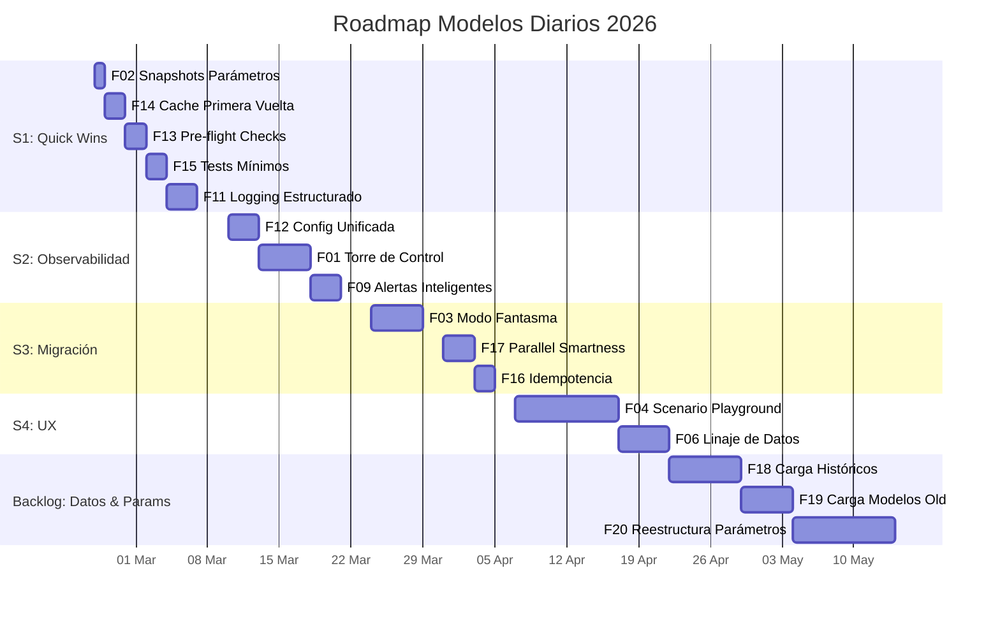
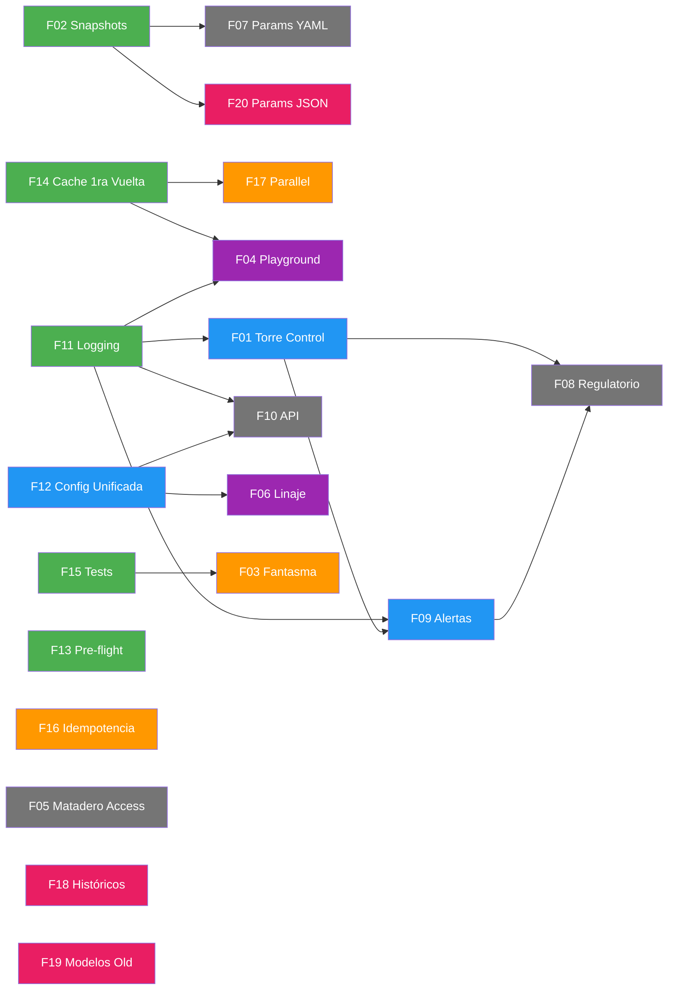

# Roadmap & Plan de Desarrollo

> **Última actualización:** 2026-02-26  
> **Fuente de verdad:** [`docs/roadmap/roadmap.yaml`](https://gitlab.falabella.tech/rmunozb/bfa-cl-modelos-diarios/-/blob/main/docs/roadmap/roadmap.yaml)

---

## Visión General

Plan de mejoras al sistema de modelos diarios, organizado en sprints de ~2 semanas.
Cada feature tiene ID, prioridad, tamaño estimado, dependencias y criterios de aceptación.

---

## Sprint 1: Quick Wins & Fundamentos

!!! info "25 Feb — 07 Mar 2026"
    Objetivo: Establecer infraestructura base — logging, caché, snapshots, tests.
    Todas las features son independientes y de bajo riesgo.

### F02 — Máquina del Tiempo: Snapshots de Parámetros { #f02 }

| | |
|---|---|
| **Prioridad** | :material-fire:{ .critical } Crítica |
| **Tamaño** | XS (< 2h) |
| **Estado** | :material-calendar-check: Planificado |
| **Archivos** | `core/orquestador.py` |

Snapshot automático de parámetros Excel antes de cada ejecución. `shutil.copy` en el orquestador → `snapshots/{fecha}/{modelo}/`.

**Criterios de aceptación:**

- [x] Cada ejecución copia los parámetros Excel a `snapshots/{fecha}/{modelo}/`
- [ ] No afecta el tiempo de ejecución (< 2s overhead)
- [ ] Funciona para los 10 modelos

??? note "Notas de implementación"
    20 líneas de código. Valor regulatorio enorme (NCG 325).
    Los parámetros locales ya están en el repo, pero los de inversiones
    viven en la red. El snapshot captura ambos.

---

### F14 — Cache de Primera Vuelta { #f14 }

| | |
|---|---|
| **Prioridad** | :material-arrow-up-bold:{ .high } Alta |
| **Tamaño** | S (2h — 1d) |
| **Estado** | :material-calendar-check: Planificado |
| **Archivos** | `procesamiento_datos_input/cache_tablas.py`, modelos de mora y prepago |

Extender `cache_tablas.py` para cachear los CSV de interfaz (`ProductosMercadoLiquidezGCP*.txt`) como parquet local. Elimina dependencia de red para re-ejecuciones.

**Criterios de aceptación:**

- [ ] Primera lectura del día: lee CSV de red, guarda parquet
- [ ] Lecturas siguientes: lee parquet local (~95% más rápido)
- [ ] Flag `--forzar-recarga` para ignorar caché

---

### F13 — Pre-flight Checks { #f13 }

| | |
|---|---|
| **Prioridad** | :material-arrow-up-bold:{ .high } Alta |
| **Tamaño** | S (2h — 1d) |
| **Estado** | :material-calendar-check: Planificado |
| **Archivos** | `core/preflight.py` (nuevo), `core/orquestador.py` |

Health checks de rutas de red y bases Access ANTES de ejecutar modelos. Evita esperar minutos para descubrir que la red está caída.

**Criterios de aceptación:**

- [ ] Verifica accesibilidad de rutas de red para modelos seleccionados
- [ ] Verifica conexión a bases Access
- [ ] Reporta problemas ANTES de iniciar ejecución
- [ ] Opción para continuar solo con modelos que tienen recursos disponibles

---

### F15 — Testing Mínimo Viable { #f15 }

| | |
|---|---|
| **Prioridad** | :material-arrow-right-bold:{ .medium } Media |
| **Tamaño** | S (2h — 1d) |
| **Estado** | :material-calendar-check: Planificado |
| **Archivos** | `tests/` (nuevo directorio) |

Tests de nivel 1 que validan configuración sin dependencias externas.

**Criterios de aceptación:**

- [ ] `pytest tests/` pasa sin acceso a red ni Access
- [ ] Valida que todos los módulos del orquestador importan
- [ ] Valida que el YAML de config es consistente con el orquestador

---

### F11 — Logging Estructurado { #f11 }

| | |
|---|---|
| **Prioridad** | :material-arrow-up-bold:{ .high } Alta |
| **Tamaño** | M (1d — 3d) |
| **Estado** | :material-calendar-check: Planificado |
| **Archivos** | `core/logger.py` (nuevo), `core/orquestador.py`, `procesamiento_datos_input/cache_tablas.py` |

Reemplazar `print()` por `logging` estándar con JSON handler. Base para Torre de Control.

**Criterios de aceptación:**

- [ ] Logger con niveles (DEBUG, INFO, WARNING, ERROR)
- [ ] Handler JSON para archivo (`logs/modelos.jsonl`)
- [ ] Handler consola human-readable
- [ ] Contexto automático: modelo, fecha_proceso
- [ ] Migrar al menos `orquestador.py` y `cache_tablas.py`

---

## Sprint 2: Observabilidad

!!! info "10 Mar — 21 Mar 2026"
    Objetivo: Torre de Control MVP + Config unificada + Alertas.

### F12 — Configuración Unificada { #f12 }

| | |
|---|---|
| **Prioridad** | :material-arrow-right-bold:{ .medium } Media |
| **Tamaño** | M (1d — 3d) |
| **Dependencias** | — |

Unificar la configuración de modelos (hoy en 3 archivos) en un solo YAML.

---

### F01 — Torre de Control { #f01 }

| | |
|---|---|
| **Prioridad** | :material-arrow-up-bold:{ .high } Alta |
| **Tamaño** | L (3d — 1 semana) |
| **Dependencias** | F11 |

Streamlit dashboard con estado de ejecución, duración, errores y métricas.

---

### F09 — Alertas Inteligentes { #f09 }

| | |
|---|---|
| **Prioridad** | :material-arrow-right-bold:{ .medium } Media |
| **Tamaño** | M (1d — 3d) |
| **Dependencias** | F11, F01 |

Sanity checks post-ejecución: variación diaria excesiva, reconciliación fuera de tolerancia.

---

## Sprint 3: Migración & Validación

!!! info "24 Mar — 04 Abr 2026"
    Objetivo: Modo Fantasma para inversiones + optimización paralela.

### F03 — Modo Fantasma { #f03 }

| | |
|---|---|
| **Prioridad** | :material-arrow-up-bold:{ .high } Alta |
| **Tamaño** | L (3d — 1 semana) |
| **Dependencias** | F15 |

Comparación automática VBA vs Python celda por celda con tolerancias. Empezando por inversiones.

---

### F17 — Parallel Smartness { #f17 }

| | |
|---|---|
| **Prioridad** | :material-arrow-right-bold:{ .medium } Media |
| **Tamaño** | M (1d — 3d) |
| **Dependencias** | F14 |

Ejecución en 2 fases con pre-carga de caché Access compartido.

---

### F16 — Ejecución Idempotente { #f16 }

| | |
|---|---|
| **Prioridad** | :material-arrow-right-bold:{ .medium } Media |
| **Tamaño** | S (2h — 1d) |

Re-ejecución segura: DELETE + INSERT en tablas históricas BigQuery.

---

## Sprint 4: Experiencia de Usuario

!!! info "07 Abr — 25 Abr 2026"
    Objetivo: Playground de escenarios + Linaje de datos.

### F04 — Scenario Playground { #f04 }

| | |
|---|---|
| **Prioridad** | :material-arrow-right-bold:{ .medium } Media |
| **Tamaño** | XL (1 — 2 semanas) |
| **Dependencias** | F14, F11 |

Streamlit con sliders para modificar parámetros y ver efecto en tiempo real.

---

### F06 — Linaje de Datos { #f06 }

| | |
|---|---|
| **Prioridad** | :material-arrow-down-bold:{ .low } Baja |
| **Tamaño** | L (3d — 1 semana) |
| **Dependencias** | F12 |

Grafo interactivo del flujo de datos generado desde el YAML de configuración.

---

---

## Nuevas Features: Datos & Parámetros

!!! warning "DRAFT — Requiere revisión antes de ejecutar"
    Las features F18, F19 y F20 tienen planes detallados en `docs/feats/`.
    Revisar y aprobar antes de comenzar implementación.

### F18 — Carga Históricos Pre-Python { #f18 }

| | |
|---|---|
| **Prioridad** | :material-arrow-up-bold:{ .high } Alta |
| **Tamaño** | L (3d — 1 semana) |
| **Estado** | :material-file-document-edit: Draft — pendiente revisión |
| **Plan** | [Plan detallado](../feats/carga-historicos/PLAN.md) |

Reconstruir la serie histórica de outputs de modelos anterior a Python.
Dos fuentes complementarias: (1) Access `RF_Modelos_Liquidez.accdb` y sus respaldos
`YYYYMMDD_RF_Modelos_Liquidez.accdb`; (2) Respaldos Excel diarios en
`Y:\RF_RESPALDO_DIARIO\RF_INPUTS`. Se espera ~95% de coincidencia entre fuentes;
implementar ambas y cruzar.

---

### F19 — Carga Modelos Old { #f19 }

| | |
|---|---|
| **Prioridad** | :material-arrow-up-bold:{ .high } Alta |
| **Tamaño** | L (3d — 1 semana) |
| **Estado** | :material-file-document-edit: Draft — pendiente revisión |
| **Plan** | [Plan v2](../feats/carga-modelos-old/PLAN-v2.md) · [Plan original](../feats/carga-modelos-old/PLAN.md) |

Pipeline diario para leer las tablas de desarrollo de modelos que aún no están
en Python (ejecutados manualmente en Excel/VBA), consolidarlas en DuckDB local
y cargarlas a BigQuery. Trabajo previo existe en `feat/carga-modelos-old`.

---

### F20 — Reestructura Sistema Parámetros y Rutas { #f20 }

| | |
|---|---|
| **Prioridad** | :material-arrow-right-bold:{ .medium } Media |
| **Tamaño** | XL (1 — 2 semanas) |
| **Estado** | :material-file-document-edit: Draft — pendiente revisión |
| **Dependencias** | F02 |
| **Rama** | `feature/reestructura-sistema-parametros-y-rutas` |
| **Plan** | [Plan detallado](../feats/reestructura-parametros/PLAN.md) |

Reemplazar los Excel de parámetros por JSON con schema definido. Soportar tipos
nativos (listas, dicts, strings, números) en vez de las limitaciones tabulares
de Excel. Mantener retrocompatibilidad durante la transición.

---

## Backlog Estratégico

Features de largo plazo, priorizables según contexto de negocio.

| ID | Feature | Tamaño | Dependencias | Etiquetas |
|:---|:--------|:-------|:-------------|:----------|
| F05 | Matadero de Access (SQL→Pandas) | L | — | `migración` `access` |
| F07 | Parámetros como Código (Excel→YAML) | XL | F02 | `parámetros` `regulatorio` |
| F08 | Copiloto Regulatorio (reportes CMF) | XXL | F01, F09 | `regulatorio` `cmf` |
| F10 | Model API (FastAPI) | XXL | F11, F12 | `api` `arquitectura` |
| F18 | Carga Históricos Pre-Python | L | — | `datos` `histórico` `access` |
| F19 | Carga Modelos Old (legacy→BQ) | L | — | `datos` `legacy` `bigquery` |
| F20 | Reestructura Parámetros (Excel→JSON) | XL | F02 | `parámetros` `schema` `json` |

---

## Grafo de Dependencias

  Sprint 1
  Sprint 2
  Sprint 3
  Sprint 4
  Backlog
  Nuevas (F18-F20)

---

## Cómo Contribuir al Roadmap

Ver [Workflow de Planificación](workflow.md) para detalles sobre cómo proponer, discutir y desarrollar features.

**TL;DR:**

1. Editar `docs/roadmap/roadmap.yaml` en una rama
2. Crear MR con etiqueta `roadmap`
3. Discutir en el MR
4. Merge → el roadmap se actualiza automáticamente en MkDocs
